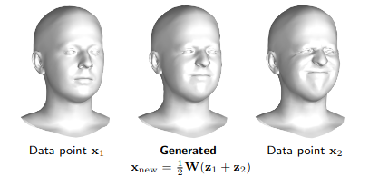
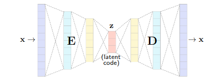
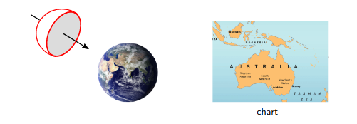
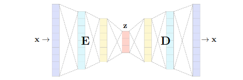
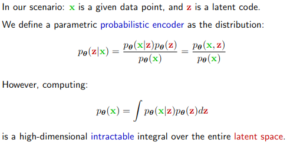
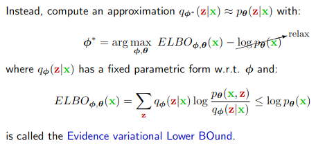
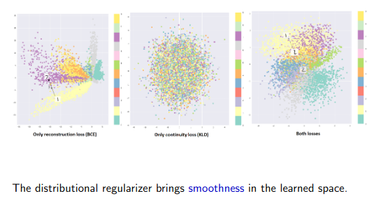

# Deep generative models

### Recall questions

Also see:
- [[BD VI - Dimensionality Reduction]]
- notes on entropy and divergence

1. 

 What is the idea behind generative models ? 

    
    \
    We want to ==learn a distribution from some training samples, and generate new samples from the same distribution==.
  

2. 

 How can we use PCA as a generative model? Why it is not enough? (Hint: it is highly suggested to revise how PCA works before answering) 

    
    \
	Once ==we learn the matrix of weights needed for reconstruction==, we can ==sample points from the space with lower dimensionality. Then, we multiply them with the weight matrix and obtain new objects==.
	 \
	The thing is ==we want a more expressive model, and the linearity of PCA is just not enough!==.

3. 

 What is an autoencoder? What does it minimize? 

    
    \
	An encoder is a ==deep neural network with an encoding portion and a decoding portion==. For a given dataset ${x_i}$, it will learn to ==minimize the reconstruction error $l_{\Theta} = \sum_i ||x_i - D_{\Theta}(E_{\Theta}(x_i))||$==
  	

4. 

 How do we ensure that no trivial solution is provided?  What is the real goal of an AE?

    
    \
  	Because of the ==bottleneck, no trivial solution is possible== (e.g. identity). \
	The task of an AE ==is always recostruction==, since what we are really interested in ==is the structure of the latent space and using E,D for new tasks== (e.g. generating new samples, denoising and so on).
	

5. 

 What can be said about the latent space and embedding in autoencoders? 

    
    \
    The goal of the decoding portion of an AE is ==learning a mapping from a low dimensional latent space to a high dimensional embedding of the observed data== \
    The ==latent space is euclidean== while the ==data embedding space is a manifold==. 

6. 

 How do you define a manifold? What are the key requirements for charts in order to be manifolds? What are the domain and codomain of the function? 

    
    \
	We define a manifold as ==a union of charts==, where each chart can be seen as a mapping $\phi \ : \ R^2 \to \textit{S} \subset R^3$. It is fundamental that $\phi$ is:
	- ==smooth==
	- ==invertible==

	And we call them a ==diffeomorphism==. The domain is the ==parametric space (euclidean)==, while the image is ==an embedding and is a surface==.
	
  

7. 

 Is the parametrization for an embedding unique? 

    
    \
	No, the ==mapping is not unique==. In general, we can potentially have ==infinitely many mappings to the same embedding==.
  

8. 

 What is the link between an AE and a manifold then? What properties does it have? 

    
    \
    The ==decoder is effectively a chart $D \ : \ R^k \to R^d$ from the latent space spanned by the codes $z$ to the data space of inputs $x$.== \
	This mapping is ==differentiable== and ==invertible through E==.
	

9. 

 What is the idea behind a variational autoencoder? 

    
    \
	A variational autoencoder works by ==constructing a probability distribution on the latent space==. The ==data is seen as a sample of the learnt distribution, which is fixed and decided a priori==.

10. 

 How do we define this probabilistic encoder? What is the main issue and how do we "fix it"? Hint: for this part is highly suggested to refer to the slides.

    
    \
	
	 \
	The main idea is that we try to maximize a relaxed version of the problem by "increasing" the first quantity enough. 

11. 

 What is the result of this probabilistic encoder? 

    
    \
	The probabilistic encoder outputs a ==gaussian distribution==. In other words, ==it won't output $z$, but $\mu, \sigma$ of our gaussian!==.
	

12. 

 Why are we modeling our priors e.g. z as a gaussian? 

    
    \
	This ensures that ==our latent space is compact==. In other words, ==two points close in the latent space will be similar once decoded==.

13. 

 Why do we need both reconstruction loss and continuity loss in our VAE? 

    
    \
	

