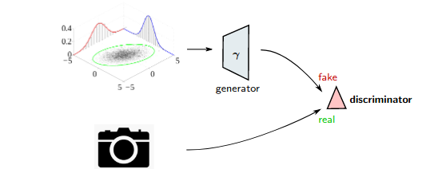
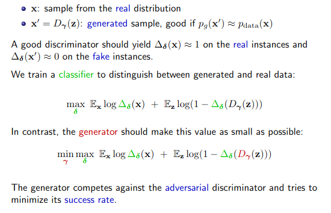
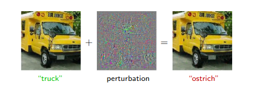
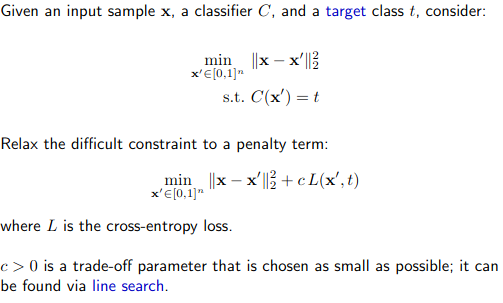
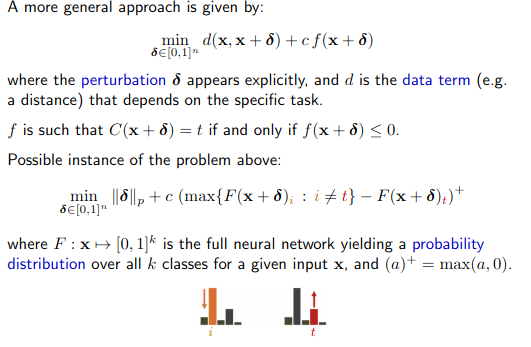
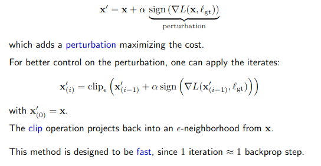

# Generative Adversarial Networks

### Recall questions

1. 

 What is the basic idea behind GANs?

    \
	The basic idea is that we train ==2 models==: 
	- a ==generator== (e.g. decoding portion of a VAE)
	- a ==discriminator==

	We then train the ==discriminator== to distinguish between ==real life data and the generated one==. The ==generator==, instead, ==is trained to make data a realist as possible== in order to "fool" the discriminator.
	

2. 

 Can you describe the idea of GANs as a minmax problem?

    \
	

3. 

 Explain the steps to follow in order to find the best generator and discriminator. What is the result of this process?

    \
	The notes for this part are from slide xx to xx.

4. 

 What are adversarial attacks? Why are they useful?

    \
	The idea behind adversarial attacks is to ==perturb the data in order to trick the model==. Note that ==we can optimize the perturbation== in order to reach this goal.
	

5. 

 What types of adversarial attacks are possible?

    \
	3 types of attack:
	- ==black box==: can only query the target model
	- ==gray box==: access to partial information (only the features, architecture, etc.)
	- ==white box==: complete access to the network (architecture, parameters, etc.)

6. 

 What is the idea behind targeted attacks? 

    \
	The idea behind target attacks is ==tricking the model into classifying data as if it were an instance of the target class==.
	

7. 

 How can we formulate targeted attacks w.r.t. to a perturbation?

    \
	

8. 

 What is the idea behind untargeted attacks ? What is the reason behind then formula? Hint: [[FDS IV - Classification]]

    \
	In the case of untargeted attacks, we have no requirements on the class that must be returned.
	

9. 

 Can we also conduct adv. attacks on other types of data, e.g. euclidean?

    \
	Yes, and we can even look for ==universal filters== that apply to multiple instances of data in the same domain.

