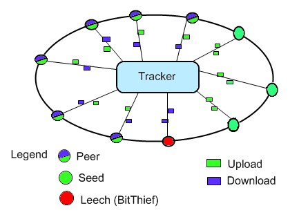

# P2P

## Recall questions
    - What is a P2P system? Make a few examples.
    - How does a P2P system work? What are a tracker, a seeder and a leecher?
    - What is the strategy employed by bittorrent?
    - What are the most common issues with P2P systems? (Hint: choking, slow last part download)

## Peer 2 Peer Systems

Systems where there is ==no central authority meant to be deployed on a global scale.==

<small> the following notes refer mostly to the protocol utilised by BitTorrent </small>

### Structure of a P2P system

==Tracker: has the list of people that share the file==

==Seed: node with all the file's parts==

==.torrent file==: contains information about
- the file name
- the tracker
- each parts' size + corresponding hash (avoid poisoning attacks)
- other relevant info

==Seeders: node that downloaded all the parts of the file==

==Downloaders==: nodes that are downloading the file
- if they choose to not upload after completion they become leechers

==Leechers: nodes that download but don't upload==

### P2P protocol

At the start, ==the tracker is interrogated by a node to identify the seeder.==
After a while, ==multiple nodes will have all the parts of the file, so the tracker has a list to identify
which of them can become seeders.==

The ==choice of which part to download is based on:==
- ==rarity==: useful to ==reduce the imbalance on the diffusion of the "rare" part, but induces a lot of overhead==
- ==an ordering==: makes for an ==easy reconstruction of the parts==
- ==a random choice==

In reality, the ==protocol works as a mix of random and rarest==:
- ==random is used at the start==
- ==rarest after the start, for most of the time==

### Issues with P2P systems

To ==reduce the amount of leechers, the system uses an unchoking algorithm.==

Every peer decides to unchoke only 4 neighboring nodes, potentially the ones that will share the file with him.
The ==unchoking is optimistic, so that the peer group periodically includes new nodes.== 

To make ==downloading the last part of a file faster, a node can enter end-game mode. In end game mode, the last part of the file
is again divided in subparts==, so that it can be treaded as a torrent to download from the various peers.