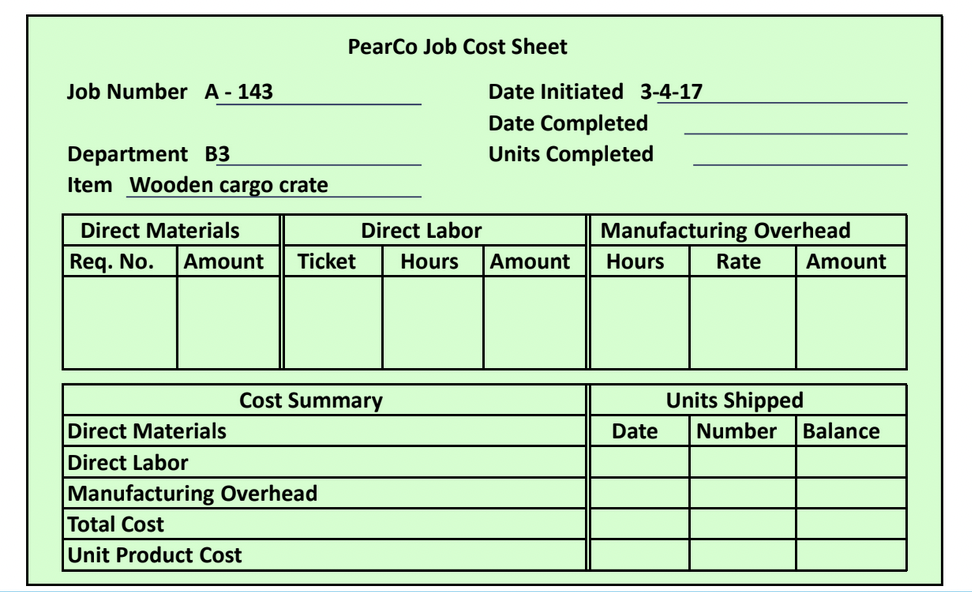

# Job Order Costing Systems

### Recall questions

1. 

 When should job cost ordering be used?

    \
    Technique to use when:
    1. ==many products are produced== ech period
    2. products are ==manufactured to order==
    3. need for ==tracing cost of each job==

2. 

 What is the job cost sheet? 

    \
    

3. 

 What is an allocation base? Why is it used? 

    \
    An allocation base is used ==to assign manufacturing overhead to individual jobs==.
    It is useful because it's ==difficult to trace overhead costs to particular jobs==.

4. 

 How is the predetermined overhead rate computed? Why is it useful? 

    \
    Predetermined overhead rate is calcualted as $\frac{EMO}{ETU}$ where $EMO$ is the ==estimated total manufacturing overhead cost for the coming period==, and $ETU$ is ==the estimated total units in the allocation base for the coming period==. \
    It is useful to ==compute the manufacturing overhead w.r.t. to the hours worked== (see the respective job cost sheet voice).

5. 

 What is the equation for the total estimated manufacturing overhead ? 

    \
    The equation is  $Y = a + bX$ where:
    - $X$ is the estimated total amount of the allocation base
    - $a$ is the total fixed manufacturing overhead cost
    - $b$ is the estimated variable manufacturing overhead cost per unit of the allocation base 

6. 

 Is it a good idea to only have one allocation base? 

    \
    If ==more than one overhead cost driver== can be identified, it is better to have multiple ==POHR== rather than a ==plantwide POHR==.

7. 

 What happens if the POHR is too low/high? 

    \
    If the overhead is:
    - too low, it ==creates underapplied OHR==, so the ==adjustement increases cost of good sold and decreases net operating income==;
    - too high, it ==creates overapplied OHR==, so the ==adjustment decreases cost of goods sold and increases net operating income==.

