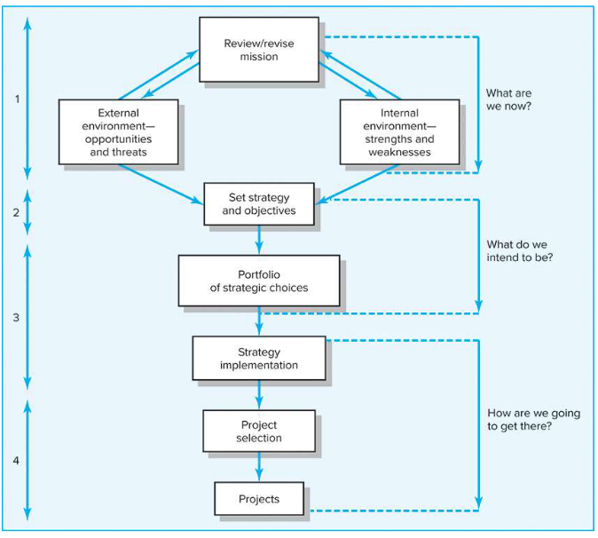
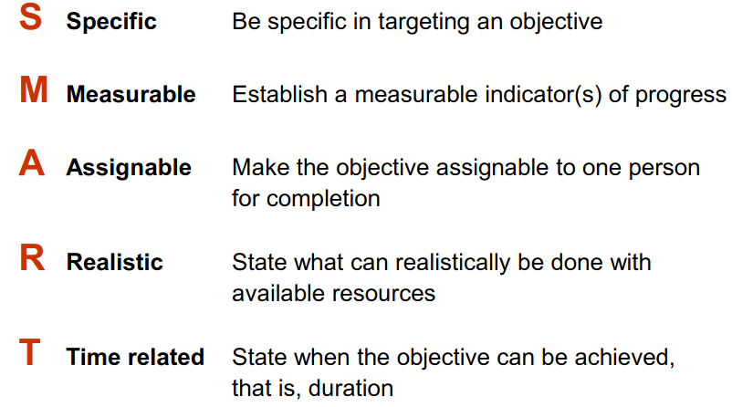

# Understanding strategy

### Recall questions

1. 

 Why do project managers need to understand strategy ?

    \
	In order to ==respond to changes with appropriate decisions about future projects and adjustments to current ones==.

2. 

 What are 4 main activities of strategic management process?

    \
    4 main activities:
    - ==review== the ==mission==
    - set ==goals==
    - ==analyze and formulate strategies==
    - ==implement== strategies
	
	

3. 

 What is SMART? How can it help in defining the characteristics of our objectives?

    \
	

4. 

  Why do we need a project priority system?

    \
	Needed in order to:
	- reduce ==implementation gap==
	- ==counteract organizational politics==
	- reduce ==conflicts==
	

5. 

What are the steps of our portfolio mgmt system?

    \
	Steps:
	1. ==classification of the project==: financial or non financial (e.g. checklist)
	2. ==selection criteria==
	3. ==sources of proposal==
	4. ==evaluation of proposals==
	5. ==mgmt of the portfolio==

6. 

 What are possible categories for our projects? 

    \
	4 categories useful to ==balance our approach==:
	- ==bread and butter: improve existing== products/services
	- ==pearls: revolutionary== opportunities
	- ==oysters: tech breakthroughs with high profit==
	- ==white elephants: no longer== viable prjs
	

