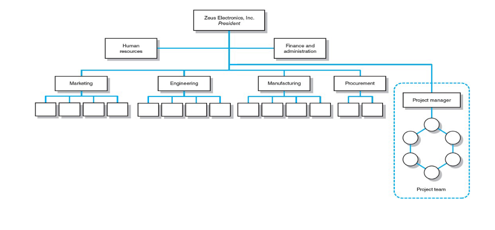

# Structure and culture

### Recall questions

1. 

 Why is it necessary to choose an appropriate project mgmt structure?

    \
	To have a ==system that balances the needs of a prj with the needs of the organisation==

2. 

 How does functional organization work? When is it used?

    \
	In functional org, we have ==different segments fo the prj delegated to different functional units==. \
	It's used when ==the interest of one functional area dominates the prj/is crucial for the success==.
	

3. 

 How does having dedicated prj teams work?

    \
	In this case, ==teams operate as separate units under a prj manager.== (i.e. are "separated from the rest of the org)
	

4. 

 How does matrix structure work? Why is it good?

    \
	In matrix structure, the ==org. structure is laid on top of a functional structure==. ==It allows for team to continue on their duties and partecipate to projects==.
	

5. 

 What are possible "shapes" for this matrix structure?

    \
	Shapes (w.r.t. authority):
	- ==weak== form: functional mgr. >> project mgr.
	- ==balanced== form: ==prj manager sets up the structure of the plan and functional mgr. decides how to allocate resources== 
	- ==strong== form: functional mgr. << project mgr.
	
	

