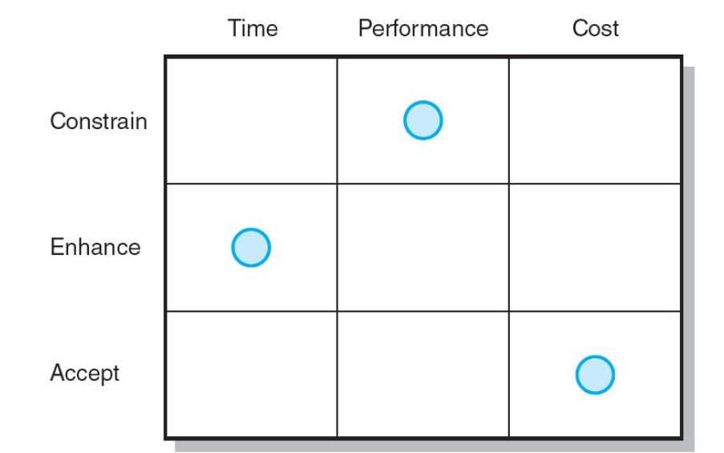
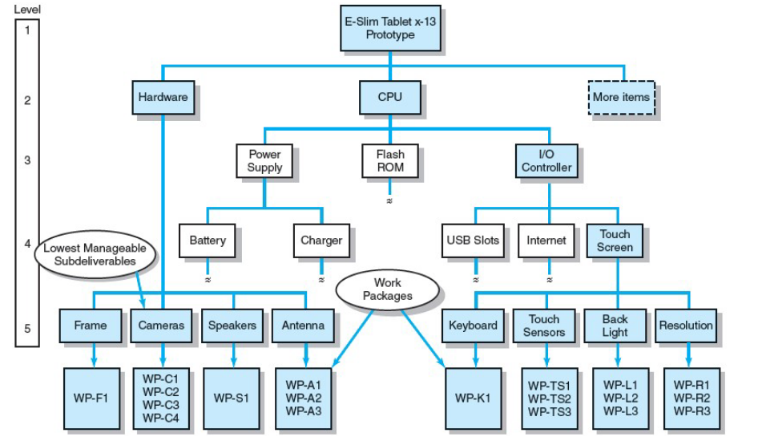
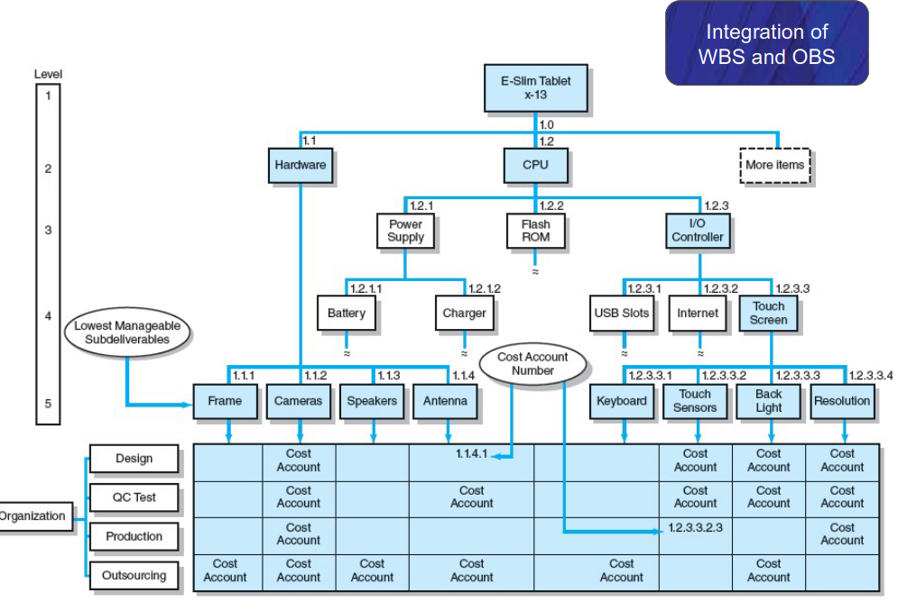
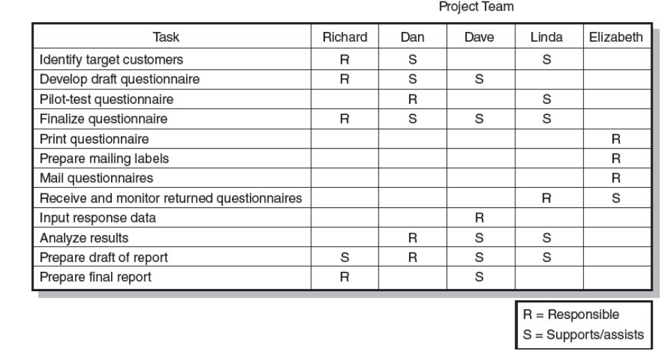

# Defining the project

### Recall questions

1. 

 What are the steps of a project?

    \
	Steps:
	1. defining the ==scope==
	2. establishing ==priorities==
	3. ==creating the work breakdown structure (WBS)==
	4. ==integrating the WBS== with the organization

2. 

 What is the scope of a project?

    \
	Definition of the ==end result of the project==. 

3. 

 What is a possible way of establishing priorities? 

    \
	We can define 3 classes:
	- ==constrain==: fixed requirement
	- ==enhance==: prioritize over the rest
	- ==accept==: non necessary to accomplish fully

	

4. 

 What is the WBS?

    \
	Work breakdown structure: a ==hierarchical outline that identifies the products and work elements involved in a project.==
	

5. 

 What is a work package?

    \
	==Lowest level of the WBS that defines all the details of the task (who, when, how, cost, etc).==

6. 

 What is the organizational breakdown structure?

    \
	It's a map that ==depicts how the firm is organized to discharge its work responsibility for a project==.
	

6. 

 What is a responsibility matrix?

    \
	It's a ==chart that summarizes who is responsible and for what==.
	

