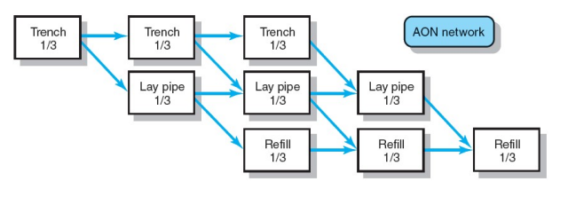
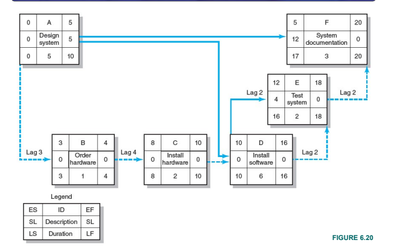

# Defining a project plan

### Recall questions

1. 

 What is the project network?

    \
	==Flow chart that graphically depicts the the logical sequences, interdependencies, and start and finish times== of the project activities along with the ==longest path(s) through the network—the critical path==
	
	

Suggested: revise terminology and how PERT works

2. 

 What are 2 techniques that can be used to make project estimates more realistic?

    \
	Two methods:
	==laddering==: break activities into smaller sequences so that the following activities can begin sooner
	==lag==: delay
	==hammock activity==: activity that spans over the segment of a project (determined after the project plan is created)
	
	 Example of laddering \
	 Example of lag
	

