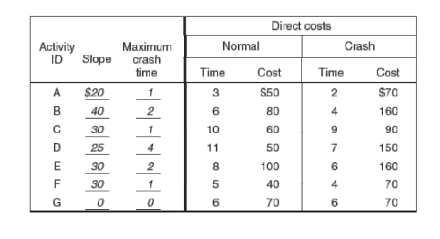

#  Reducing project duration

### Recall questions

1. 

What is the best way to reduce project time?

    \
	If we are ==able to identify direct costs, we can reduce project time by spending more== (i.e. increasing costs).
	
	

2. 

Why are we looking for that? Why not indirect?

    \
	==Direct costs can be traced directly to a certain activity or work package==. Indirect costs are much harder to trace, e.g. administration and such.
	

3. 

 How do we decide which activities to shorten?

    \
	We shorten the activities ==with the smallest increase in cost per unit time==.
	
	

