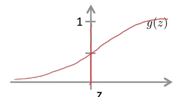
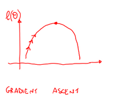
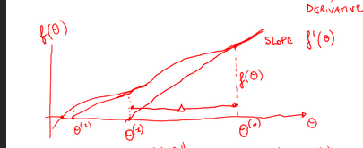
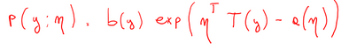
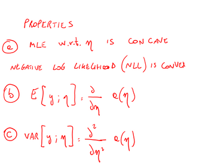
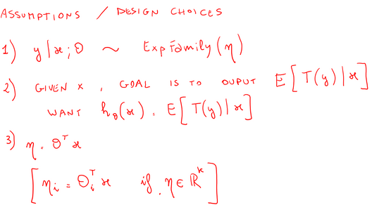
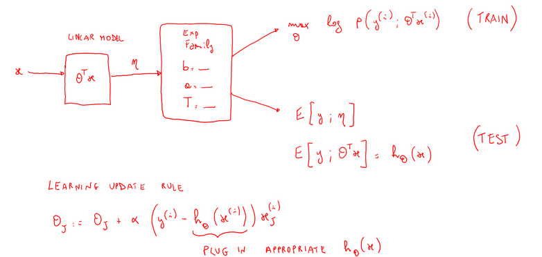
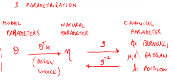

# Classification and more

## Recall questions

### Logistic Regression 

What is logistic regression? What is the function used to transform the hypotesis and why do we do so?

What is the likelihood in the case of a binary classification logistic regression? Why do we want to maximize it?

What is the update rule? You can also report the general update rules for generalised linear models.

What is Newtown's method for optmisation? Why do we use gradient ascent/descent instead? You can refer to the notes for this one...

### Generalised linear models

What is the exponential family of distributions? Make a few examples using known distributions.

What desirable properties are true for distributions of this family?

Which assumptions do we make when modeling a problem with a generalised linear model?

What is the general workflow? Make examples with known distributions (e.g. gaussian, bernoulli).

 
Why do we have 3 types of parametrizations? What are the link and response function?
Why is the link function useful?

