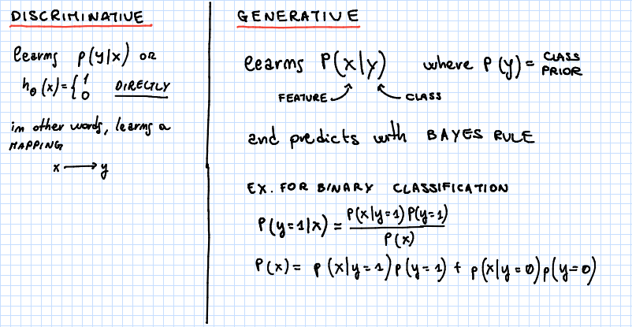
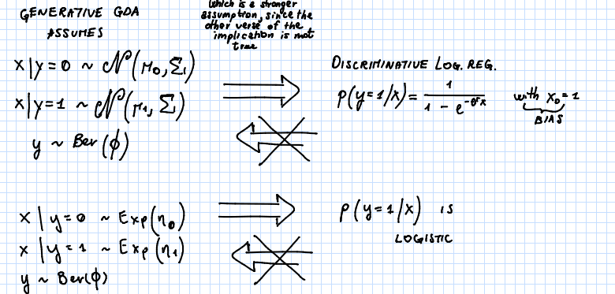
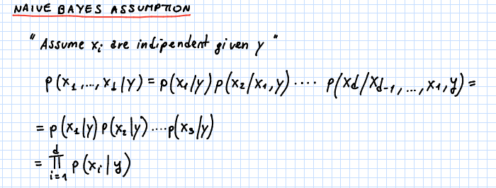

# Generative Linear Models

## Recall questions

- What is the difference between a generative and a discriminative model? 

- What is Gaussian Discriminant Analysis? What assumption do we have to make?

- What is the model of the GDA? How do we determine a class for an instance?

- How do we tune the parameters in GDA? What is the end result? Is it "obvious" or "intuitive"?

- How do we effectively make a decision?

- What is the main difference between GDA and logistic regression? Why the assumptions for GDA are stronger than the ones for logistic regression?

- If we were to design a spam filter, keeping track of the joint likelihood of the parameters (as per definition of a generative model) would quickly become impossible. Explain how the naive bayes model makes things easier with it's key assumption.

- What are the parameters for the naïve bayes model (spam filter)?

- What is laplacian smoothing? Why is it necessary?

- What is the multinomial bayes model? What advantage does it have over the normal multivariate one?

- What are 2 things to look out for when dealing with naive bayes?

