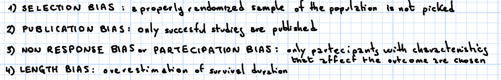
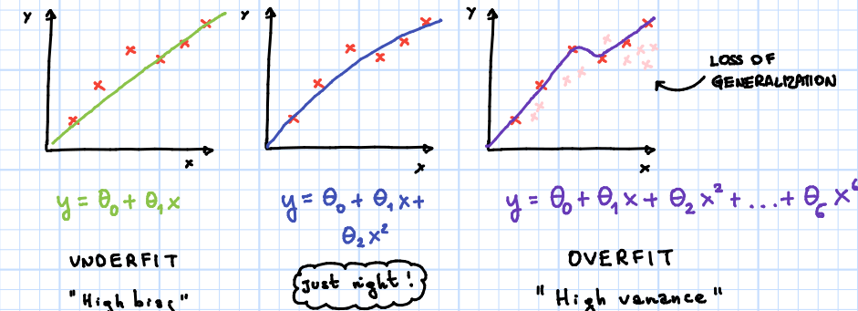
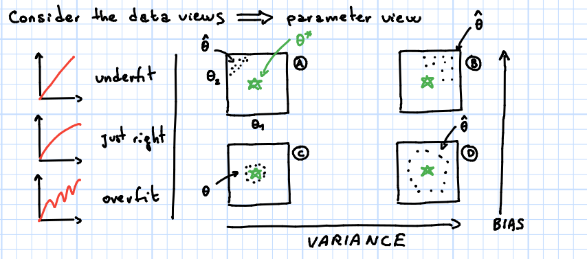
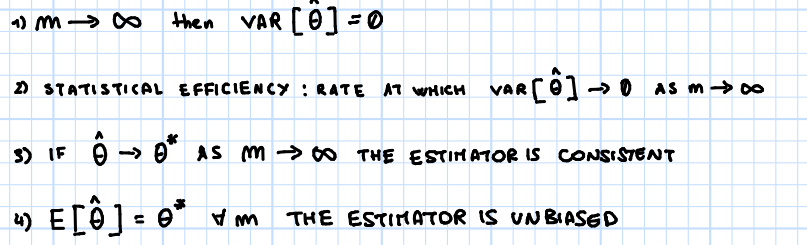

# Bias and Variance

Highly suggested to also read #[[ML VI - Performance Evaluation]]

## Recall questions

- Give a description of some of the most common types of bias.

- To what does a high variance/high bias correspond when training a model? (Notice: this is just the intution, formal def. comes later)

- What happens to the parameters as we train a model with high variance/bias?

- What is a consistent estimator? And one that is unbiased? What is statistical efficiency?

