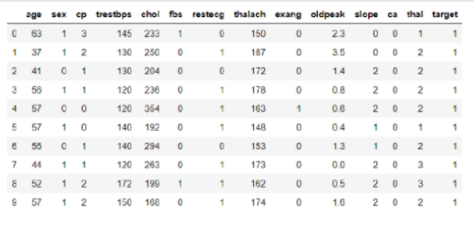
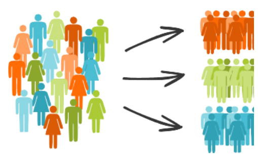
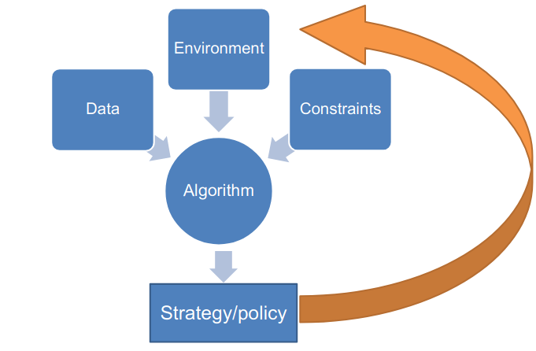

# Introduzione a ML

## Recall questions
    - What are predictive and prescriptive learning?
    - Describe the typical workflow in both cases.

## Basic notions

### Machine Learning in a Nutshell

Set of methodologies to find regularities in data

### Type of tasks

==Predictive tasks==: ==given previously labelled data, learn a model to predict future outcomes== 
- i.e. predict future sales of a new product
- labelled data can also be discrete/continous

==Prescriptive==: ==given unlabelled data, or given an environment/some stimuli, prescribe the best course of action==
- i.e. model learning to play a game or customer segmentation

### General Workflow

==Supervised workflow==: 
1. historical data $\to$ algorithm $\to$ predictive model
2. new unlabelled data $\to$ predictive model $\to$ prediction (opt. confidency)

Instead of updating the model, it is commonly preferred to just train a new model on the new (bigger) set of data
- there is still the possibility of creating an adaptive model

==Unsupervised workflow==:

### Importance of data

==Data needs to be collected and categorized before becoming usable for a ML model==
- main and hardest part of the work

### The heart of ML

To program systems that can learn, ==we need to understand what learning is and how we learn==

There are things difficult to learn or to teach for us humans but not for machines
- i.e. when there is too much data, the environment is dangerous...
- i.e. when there is not enough previous expertise to gain knowledge...

### ML applications

ML is best applied when there is:
- no previous expertise, i.e. speech recognition
- too much data / data that changes too frequently
- a knowledge engineering bottleneck, i.e. systems ....
- the need to develop systems that can adapt / customise 
- the desire to discover new knowledge

