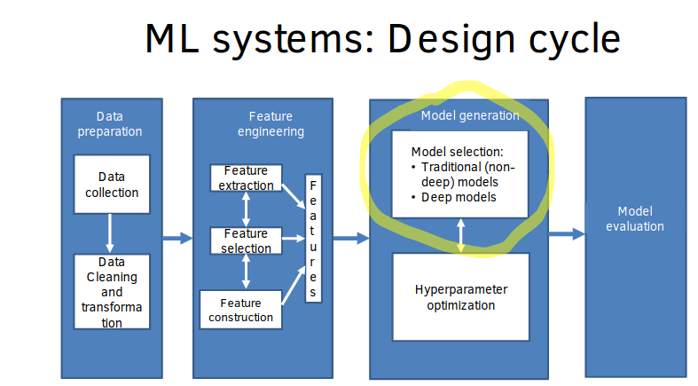
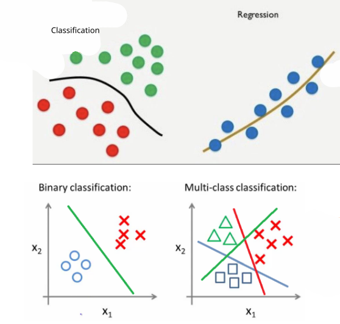
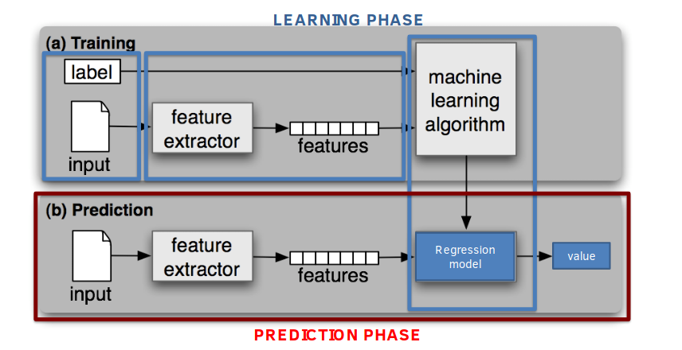
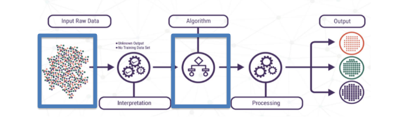
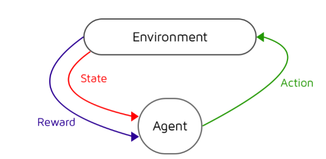

# Building a ML system

## Recall questions
      - What are the steps of the design cycle?
      - Describe briefly what is done in each step.
      - What should be considered when choosing data for a ML system? What can be done to improve the quality of the data?
      - What is the purpose of feature engineering?
      - What are the available models to choose from when designing a ML system?
      - Learning is an ... problem. 
      - What are hyperparameters? Why are they important?

## Phases of the build

### Design cycle of a ML system

### Data preparation

In this step we identify:
- the ==correct type of data to collect==
- ==where== to collect it
- if the ==data is ready== for analysis

### The importance of data

When choosing the data for a ML system:
- the type matters (i.e. images for DNL)
- ==the quantity, quality and how we represent it== is important too (i.e. DNL work with pixels, other ML algorithms may need some preprocessing on the image)

==Data== is also commonly ==heterogenous and will probably need to be reorganized== by
- ==transformations==: cleaning errors and reduce redundancy
- ==preprocessing==: renaming, rescaling, etc...

### Feature Engineering

==Feature engineering is about finding the best descriptors==
- ==feature identification==: sometimes the features are just too many so we need to identify the important ones
- ==dimensionality reduction==: or some of them can be converted to "higher level" semantic descriptors

One way of doing this is by using dimensionality reduction

### Model Generation

When choosing the right model we can ==decide==:
- the ==type of learning== we want to adopt (i.e. supervised)
- the ==type of prediction== the system will output (e.g. continous function)

The choice is among:
- ==supervised learning==: training data with correct examples
- ==unsupervised learning==: no data with correct examples
- ==semi-surpervised learning==
- ==reinforcement learning==: rewards based on correctness of chosen strategy

Another importance difference is the one among:
- classifiers: discrete function to find boundaries
- regressors: continous function to best-fit curve

Some examples:

In the classification the line is used to tell to which category the new object belong, in the regression
is used to predict the next value given the input. The output line can also be non linear (e.g. the function is a polynomial)

### Hyper parameter tuning

Learning is an ==optimization problem==: so ==parameters and hyperparameters must be optimized==!

Main difference:
- parameter: configuration variable internal to the model
- hyperparameter: configuration variable set ==prior== to creating the model

Generally the ==hyperparameters== are set before the training phase, when the parameters are instead learned.
- ==different hyperparameters can lead to different models!==

## An overview on learning models

### Supervised learning

Given examples ($x_i,y_i$) of an unknown function $y = f(x)$ learn $f(x)$ to predict its values (labels)
for unseen examples of $x$.

If $f(x)$ is:
- discrete: classification
- algebraic (continous): regression
- probability: probability estimation (still similar to regression)

In the course we'll see:
- discrete classifiers: decision trees, decision forests, Supported Vector Machines
- continuous classifiers: neural networks
- probability esitmators: Naive Bayes
- ensambles: combination of many predictors

### Unsupervised learning

In unsupervised learning, data is unlabeled and the algorithm learns a function used to group instances according to some kind of similarity
- but similarity is an ambigous concept!

In the course we'll see:
- untrained deep networks: autoencoders
- rule learning: Apriori, FPGrows
- clustering: K-means an hieararchical clustering

### Reinforcement learning

In reinforcement learning, the objective is to learn a policy to act in an environment. There are no examles,
so the model (agent) learns by receiving rewards or penalties based on his behaviour.