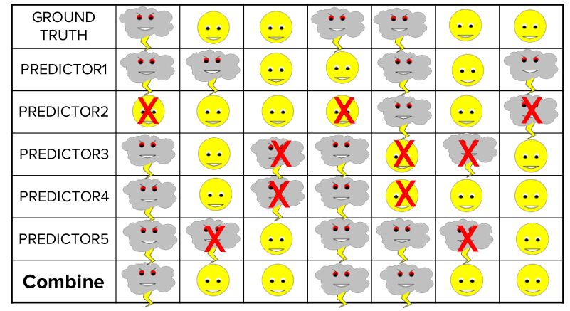
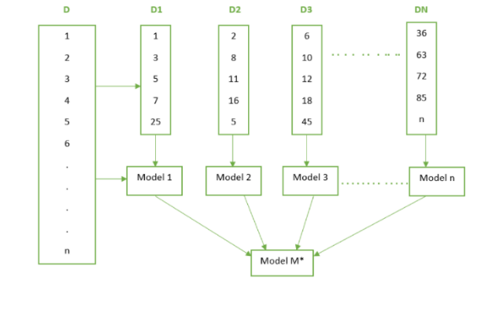
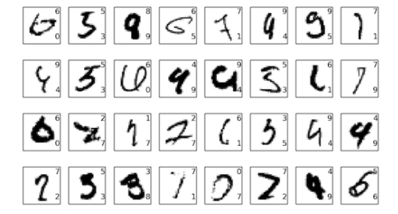
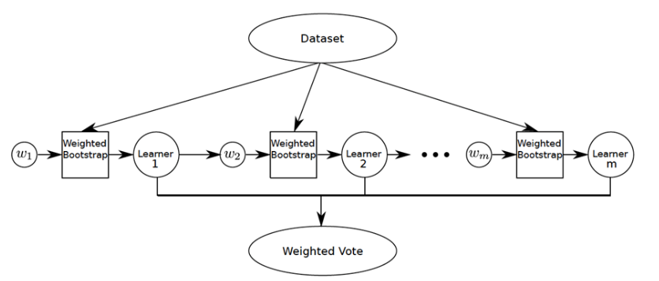
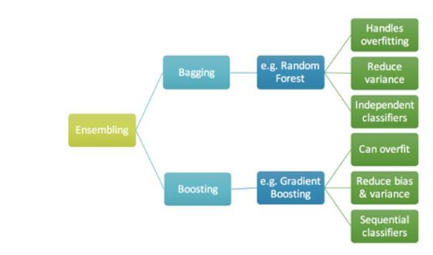

# Ensemble methods 

## Recall questions
   
### Ensembles

- What is an ensemble? What are the main reasons to use them?

- What can be said about variance and error rate of ensemble methods? What is a necessary requirement for the latter?

- What are 4 common ways of training ensembles?

- What are homogeneous ensembles? List 3 techniques for data division.is 

### Bagging

- What does bagging stand for? What does it reduce?

- What is bootstrapping? How is the data that is not extracted in the boostrapping rounds used?

- What is a 0.632 boostrap? Why is it called this way?

- How do we determine the final prediction of an ensemble method?

- Describe the 2 common voting techniques: why is soft voting way more complex than hard voting?

- How does averaging work instead?

- What are the benefits and downsides of bagging? What happens when there are instances difficult to classify?

### Boosting

- How does boosting work and what is the main goal?

- How does boosting use weighted bootstrapping?

- How is the final vote decided?

- What is ADAboost? How does it work?

- How many classifiers are trained? What is the importance (or authority) of a classifier?

- How is the final vote decided?

<small> Ask for clarification !! </small>

### Random forests

- How do random forests work? Are they used for a specific ML model?

- Why do we say that random forests have "2 sources of randomness"?

- How do random vectors work? Why do they avoid correlation in trees?

- What are the main advantages of random forest?

- How do RF compare to ADAboost or Deep methods?

### Gradient boosting machines

- What is the idea behind gradient boosting machines?

- Why do residuals express the gradient?

- What do we do with the hypotesis at each step?

- What is another popular variant of GBM? What are the differences with normal trees?

### To recap

