# Deep learning

## Recall questions

- What is the main issue of backpropagation with some activation functions? What happens when the input becomes really big/small?

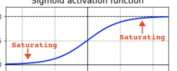

- What is the activation function used to solve the vanishing gradient problem? What are other 2 techniques to solve the vanishing gradient problem?

> Relu : $max(0,x)$

- What are CNNs? What are they mainly used for?

- What is a 2D convolution? How is achieved in the case of a CNN? Are all the nodes connected?

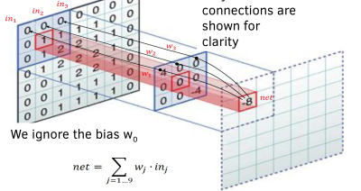

- What is a slice/channel? What are 2 possible ways of computing convolutions if we have multiple slices?

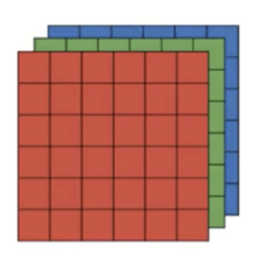

- Describe how compression of a volume happens with help of the following image. What ooes the depth of the resulting volume represent?

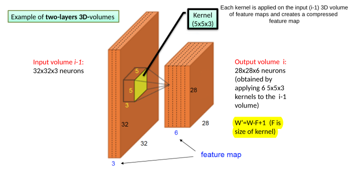

- What is a kernel? Why we can only give a "rough idea" of what a kernel really does? 

- How do we choose the weights of the kernels? And the size? Why does a small/big size change the result?

- What are the 2 extremes of kernel sizes?

- What is a good approach for testing different kernel sizes?

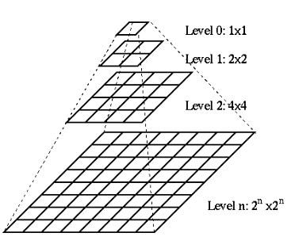

- What is the stride? Why it is useful? How is the size decided?

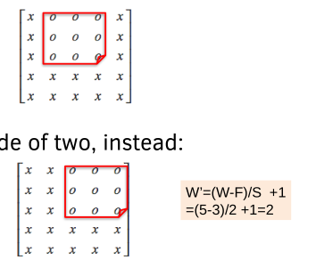

- What is padding? What is its purpose?

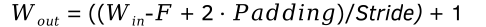

- What are the 3 main advantages of relu? Do other functions exist? (Name a few)

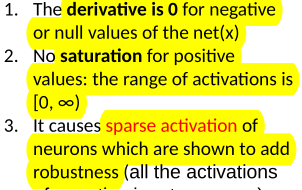

- What is pooling and how is it applied ? What are the advantages and the caveats? Describe 2 common pooling techniques.

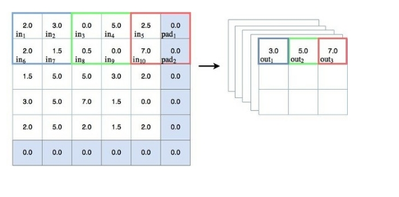

- How is the last layer of a CNN different from a normal NN? What is the activation function and how is the error computed? How is the fully connected layer connected to the softmax?

### Stacked denoising auto encoders (anomaly detection)

- What is a stacked denoising auto encoder?

- What is an auto encoder? What are its components?

- Why the final output of an autoencoder is not really a reconstruction? What is a proper definition for it?

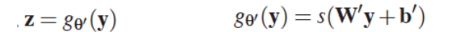

- What is a naive implementation of autoencoders? What importation assumption is missing?

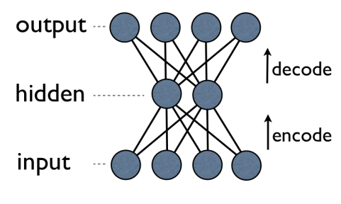

- What is a main utilisation for denoising auto encoders?

- How is a denoised auto encoder trained?

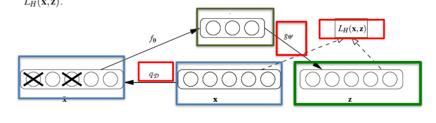

- How are the encoders stacked?

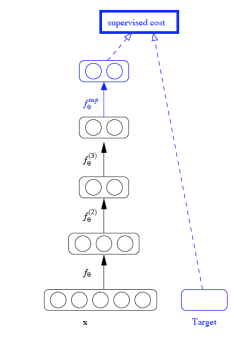

- What are the main issues of DNN? How can we cope with each of them?

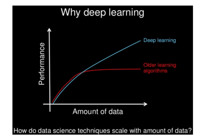