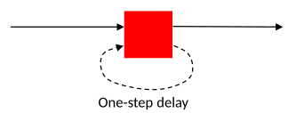
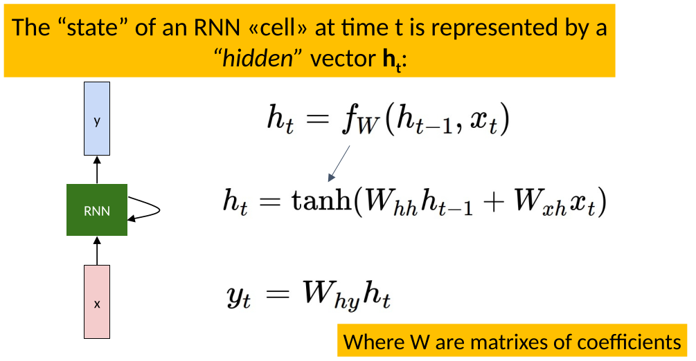
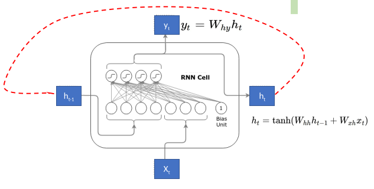
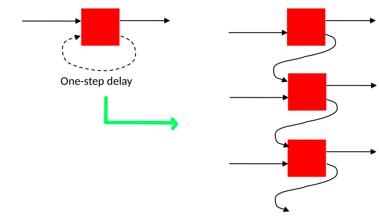
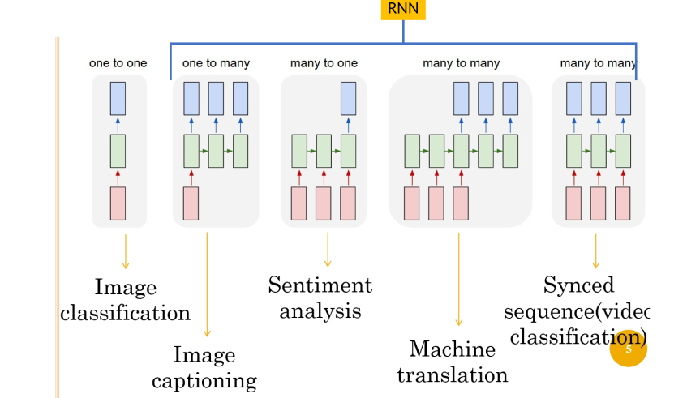

# Recurrent neural networks

## Recall questions

- What is the difference between a normal NN and a RNN? What is their main purpose? What do they introduce?

- What is sequential data?

- What is the state of a RNN cell? Break down the formula and explain its components.

- How does a RNN cell work?

- How are RNN cells unrolled? What does this allow to do?

- How are unrolled cells stacked together to achieve a Deep RNN? What is the shape of the last layer?

- How many possible architectures of RNN are possible?

