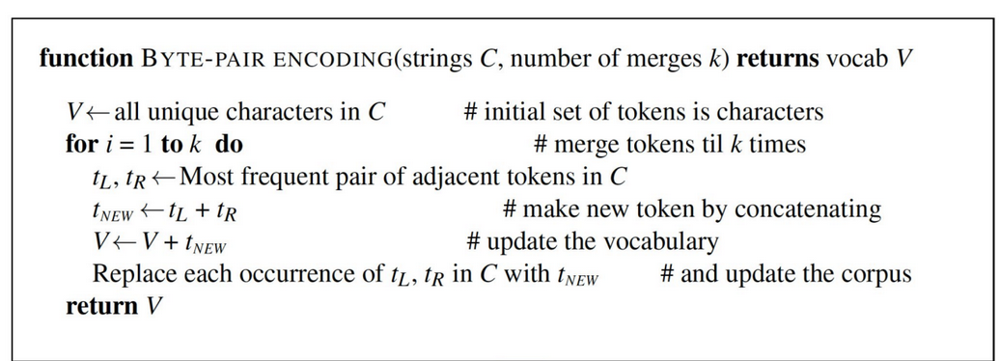

# Words and corpora

### Recall questions

1. 

 What is a corpus? And an utterance?  

    
    \
    A corpus is a ==computer-readable== collection of text or speech. An utterance is ==the spoken equivalent of a sentence==, complete with pauses and micro-expressions like "uh".

2. 

 What is a lemma? And a word form?  

    
    \
	A lemma is a ==set of lexical forms having the same stem and similar word sense==.
	A wordform is a ==full inflected or derived form of a word==.

3. 

  What is the difference between word types and word tokens? What is tokenization and why it might not be easy? 

    
    \
    Word types: ==set of distinct words in a corpus==. If $V$ is the vocabulary of the corpus, then $|V|$ is the amount of word types.

	Word tokens instead is ==the collection of all the words used==.

	Example: 

4. 

  What are the 3 steps of text normalization?  

    
    \
    Before processing it is common to normalise text. This includes three main steps:
    - ==tokenising (segmenting) words==
    - ==normalising word formats==
    - ==segmenting sentences==

5. 

 Describe the Penn-Treebank algorithm. What are possible issues that you'd encounter using it?   

    
    \
    Treebank alg: 

	Potential issues with ==foreign languages, like Chinese/Japanese==. 

6. 

 Describe the byte-pair encoding process. What are the 2 main components? 

  
    \
    The byte pair encoding is comprised of two elements:+
    - token ==learner==: 
    - token ==parser==

	See the slides for a full example.

7. 

 What is word normalization?   Describe possible steps it could include and the way they work.  

    
    \
	Word normalisation is the task of putting ==words in a "standard" format==. Some examples include:
	- making all words ==lowercase==;
	- ==lemmatization by stemming==, for example with a Porter Stemmer;
	- and so on...

7. 

 What is sentence segmentation?  

    
    \
    Sentence segmentation is the task of ==identifying sentences' boundaries from text==.

