# Language Models

### Exercises

List of potential exercises:
- computing the MED
- computing probabilities for a N-gram model (see final slides)
- exercises on Laplacian smoothing

### Brief Recap on Minimum Edit Distance

For this section, review the algorithm presented in 1.6 (Spelling and Mistakes correction).

### Recall questions on Language Models

1. 

  What is a language model? Why would we want to use one over a formal grammar?  

    
    \
    A language model is a ==probabilistic distribution over sequences of words==.
    In general, it is more ==flexible== compared to formal grammars, that only provide a binary choice when deciding whether or not a string belongs to the language.

2. 

  What is relative frequency estimation? Why using it with language models is unfeasible? 

    
    \
    In our context, we refer to estimating the relative frequency of a sequence of words by ==counting how many times a sequence appears, then applying the conditional probability over that sequence==: 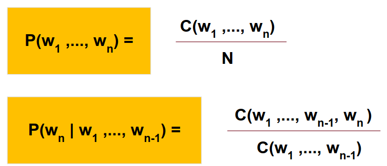

	This way of computing probabilities is very ==computationally expensive==: imagine applying the chain rule to the entire sequence (we'd also need to compute all the probabilities of the shorter sentences)! 

3. 

  What is the intuition behind N-gram models? Show you understanding by computing the formulas for the 2-gram and 3-gram. (Hint: Markov)

    
    \
    The intuition of the N-gram model is that ==we assume the Markov property to approximate the history of a sequence by just the last N-1 words==:

	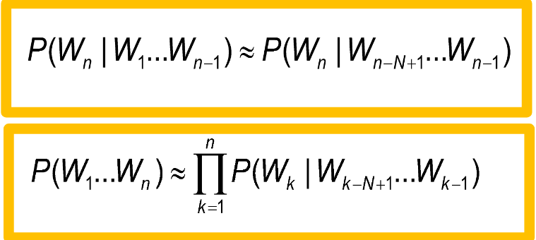

	Formulas for 2/3-gram: 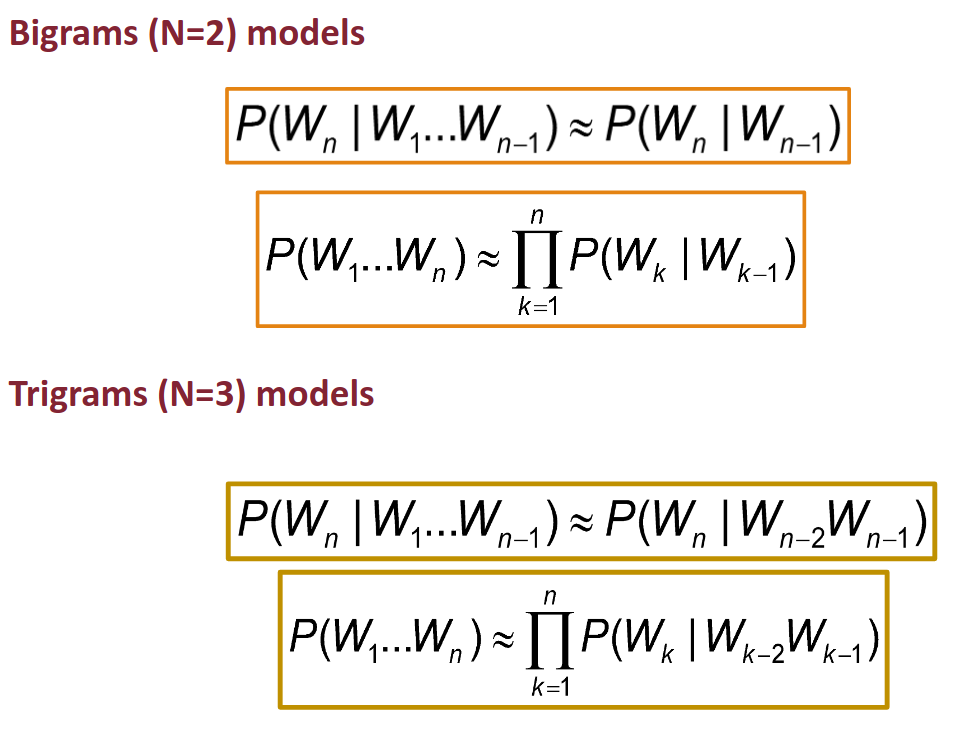

4. 

 What are the advantages of big/small N-gram models? And cons? 

    
    \
    In general:
    - a ==larger N== implies ==more information about the context of a sequence==, but suffers more from ==sparsity and bias w.r.t. to the most frequent sentences==;
    - a ==smaller N== is ==less "precise"==, but provides more ==examples of statistical significance (i.e. more samples)==.

5. 

  What is Zipf's law? What does this imply? 

    
    \
    Zipf's laws tells us that ==the frequency of any word is inversely proportional to its rank in the frequency table with exponential decay==: 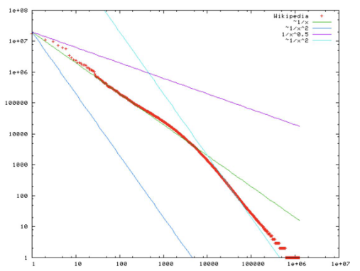

	This implies that there will be a large amount of words for which there is a ==low probability==, creating a ==bias in our model==.

6. 

  What is the difference between closed and open vocabulary? 

    
    \
    Vocabulary types:
	    - closed: we have a ==fixed vocabulary== and all ==words in the test set will be from such vocabulary==
	    - open: we model unknown words as ==Out-Of-Vocabulary Words== (OOV). We ==convert them to a token (UNK)== of which we also estimate the probability, just like any other word.

7. 

  What is the difference between intrinsic and extrinsic evaluation metrics? Give an example of intrinsic metric for language models. 

    
    \
    Types of metric:
    - extrinsic: assesses the quality of the model through "in-vivo" testing, i.e. embedding the model
    - intrinsic: assesses the quality of the model via internal metrics

	In the case of language models, we use ==perplexity==:
		- perplexity for a ==word sequence==: 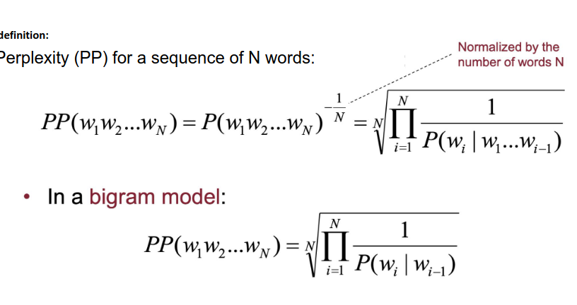
		- perplexity for a ==corpus==: 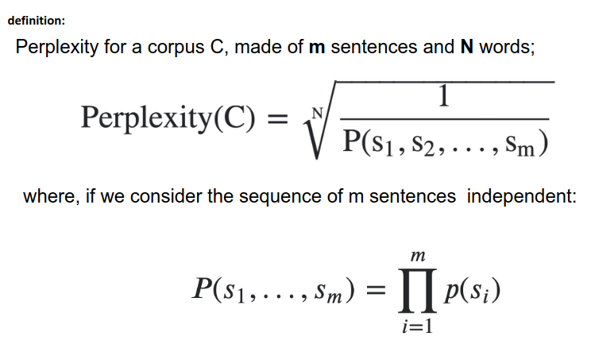

8. 

 What is smoothing? Why is it necessary? 

    
    \
    Smoothing is necessary ==to counter sparsity and take into account unigrams not seen in training==.

9. 

 Describe the steps for laplacian smoothing. What is the main drawback of using it? 

    
    \
    Laplacian smoothing consists in ==simply adding 1 to the count of each unigram==; it is in fact also know as ==add one smoothing==.

	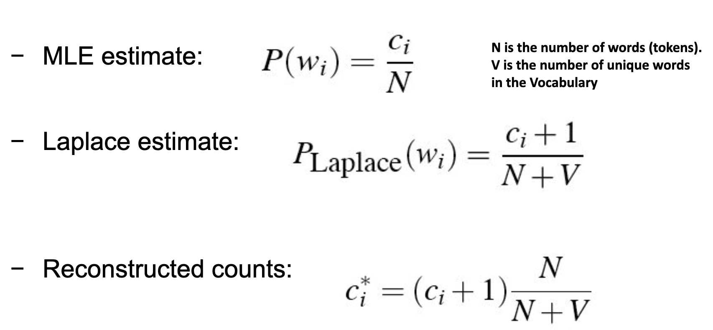

	The issue with Laplacian smoothing is that is a very ==imprecise (?) instrument, in the sense that it shifts a lot of probability mass to the zeros==, resulting in heavy discounts for the existing probabilities. 

10. 

 What is the add-k smoothing?  

    
    \
    Add-k smoothing is a ==generalized version of Laplacian smoothing in which a $k$ value is added instead==: 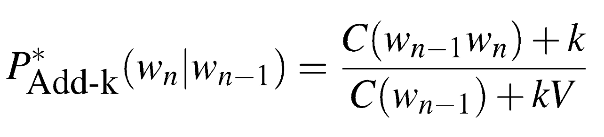

    It still suffers from the same issue of Laplacian smoothing, but it can be mitigated through hyper-parameters tuning.

12. 

 Describe model combination methods. Which techniques are available?  

    
    \
    We have different alternatives:
    - ==linear interpolation==: 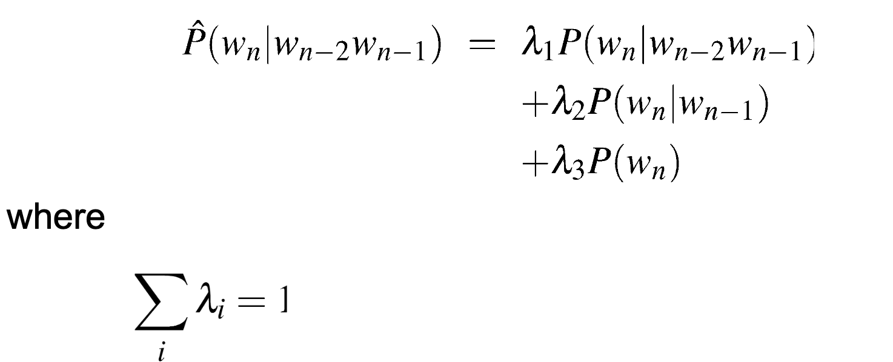
    - ==katz back-off==: 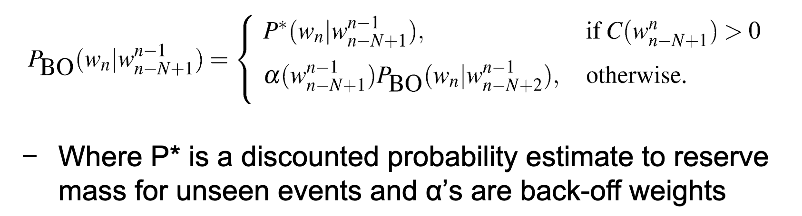
    - ==stupid back-off==: 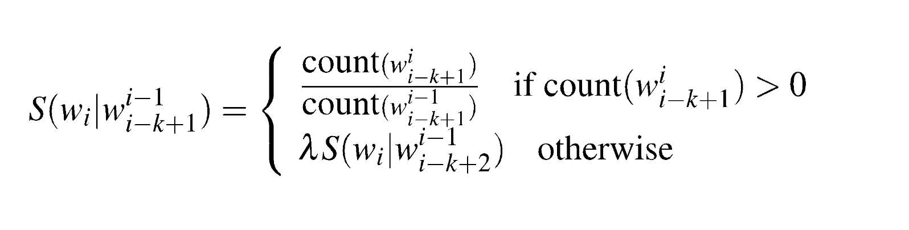
    - ==absolute discount==: 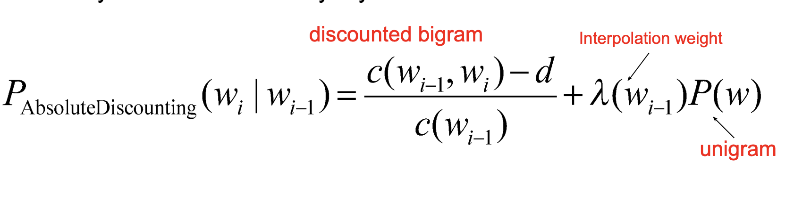

