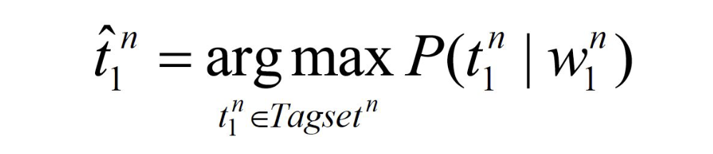
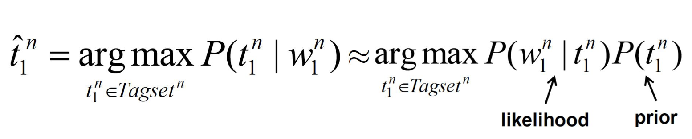
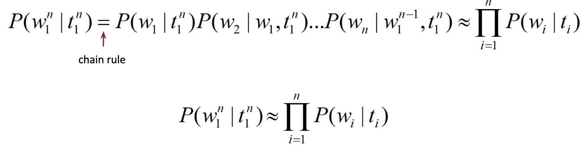
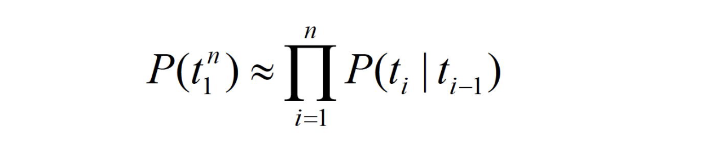
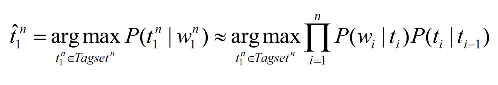
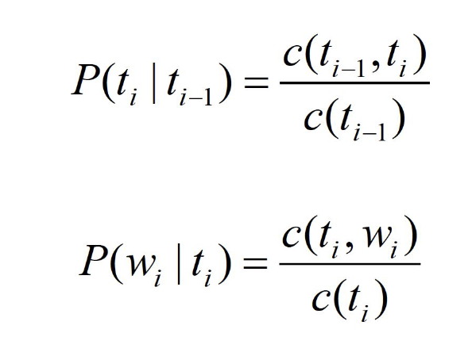
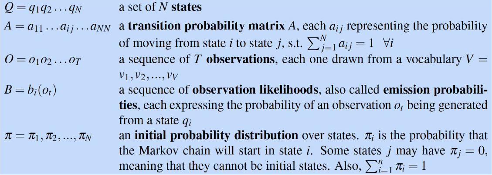
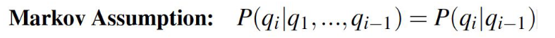
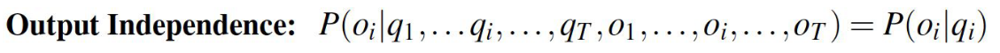
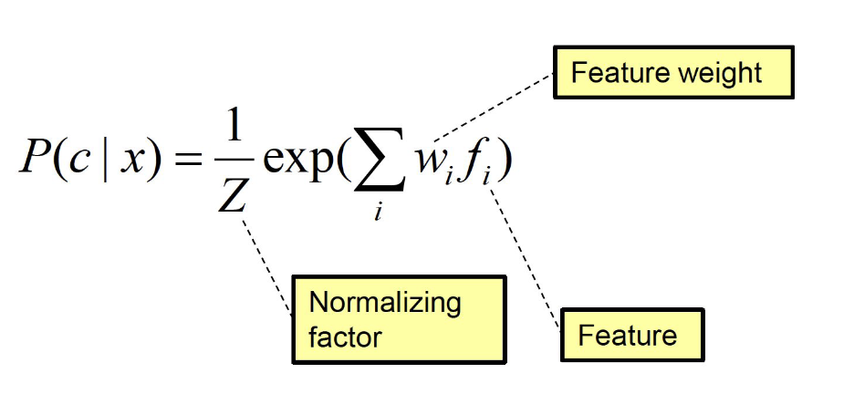

# Speech tagging 

### Exercises

List of exercises:
- viterbi algorithm

### Recall questions 

1. 

 What is the part of speech classification? Why is it necessary/useful ? 

    
    \
    The goal of PoS (Part Of Speech) is ==classifying different words into classes==. This classification can help to ==understand context, to find mistakes== and so on.

2. 

 What are closed/open classes?  

    \
    Two main classes:
    - closed: ==new words for this class are unlikely to be coined==, e.g. prepositions;
    - open: ==new words for this class will likely be coined==, e.g. nouns or verbs.

3. 

  What is the main difficulty when determining PoS? 

    
    \
    The main difficulty of tagging words is ==ambiguity==. The word "will" is a good example: it could be a name, a noun or even a verb depending on position and how is written.

4. 

  Describe the idea behind Stochastic PoS tagging. What are the main simplifications?  

    
    \
    The idea behind PoS stochastic tagging is to predict tag ==performing a MLE==: 

	Using ==Bayes theorem and removing the denominator==, we can rewrite this as: 

	To simplify things, we first assume ==probabilities to be independent (Naive Bayes)== and that ==the probability of each word only depends from its tag==: 

	Then, we also assume that ==the prior of each tag only depends from the previous tag in the sequence== (and not the entire sequence of tags): 

	The final formula to optimise is: 

	If we have a ==tagged corpus==, we can now estimate probabilities using the relative frequency: 

5. 

  What is a Hidden Markov Model? Why do we use it?

    
    \
    Although we presented a way to "estimate" both the likelihood and the prior, we still ==need to find the global PoS tag sequence which maximises the final product==!

	To achieve our goal, we can use a ==Hidden Markov Model==: 

	The great thing about HMM is that they ==respect our previous assumptions==:
	- ==the probability of ending in the next state only depends from the current state (Markov Assumption / Bi-gram assumption)== 
	- ==the probability of a word being emitted depends only from its tag (output independence)== 

6. 

  How do we apply the HMM in practice?

    
    \
    In practice, ==given a training dataset, i.e. a PoS tagged corpus==, ==$Q$ is the tagset, $O$ is the set of words==, $\pi$ is computed by counting how many times a PoS tag occurs at the start of a sentence.

	The probabilities can be computed as show in q.4
	

7. 

 What is MaxEnt? How is the probability for a certain class computed?  

    
    \
    MaxEnt belongs to the family of classifiers known as the ==exponential or log-linear classifiers==. It works by extracting a set of ==features $f_1 \dots f_n$ from the input== and combining them linearly.

	The goal is to maximise the following probability: 
   

--- 

Note that the class can also be predicted using logistic regression, see [[BD IX - Logistic Regression]]