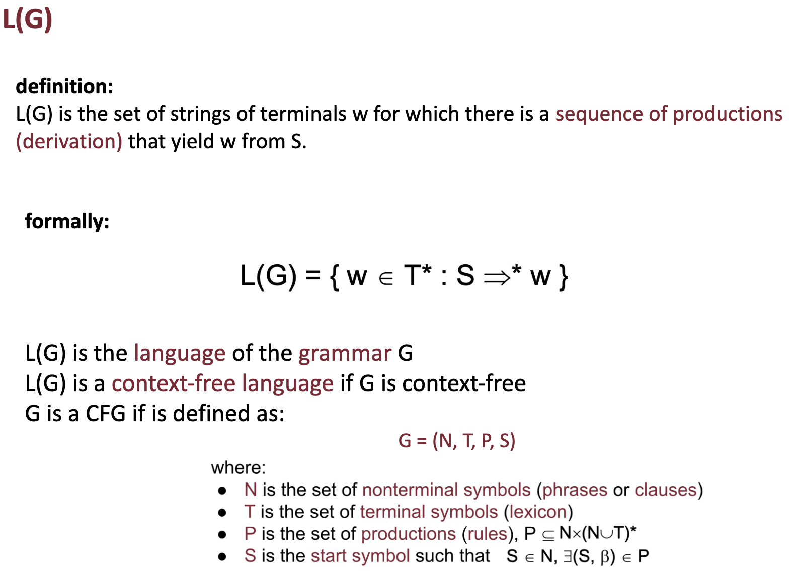
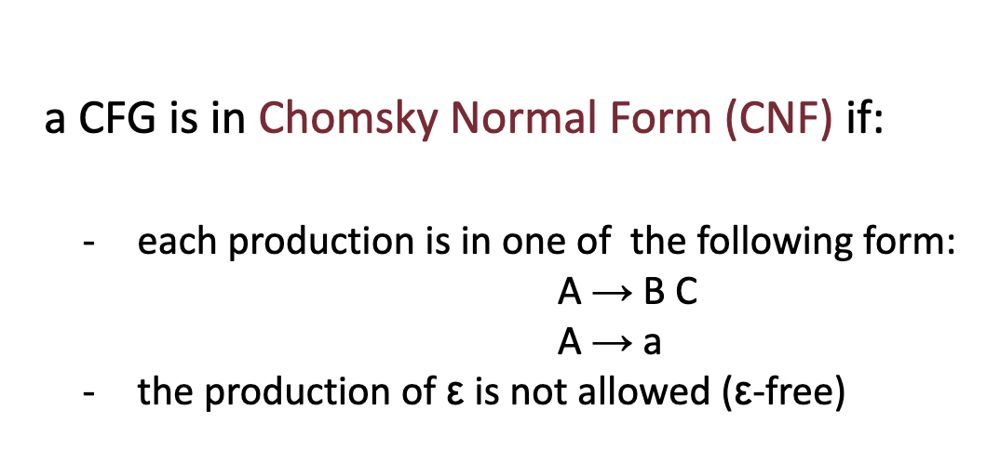
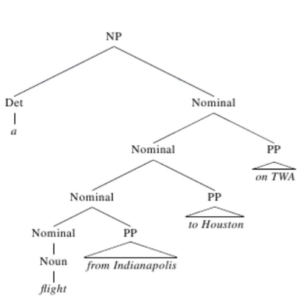
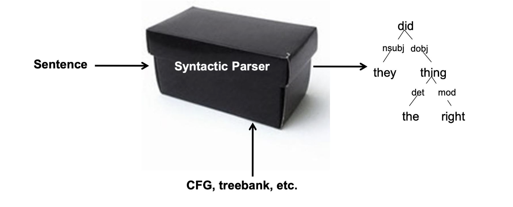
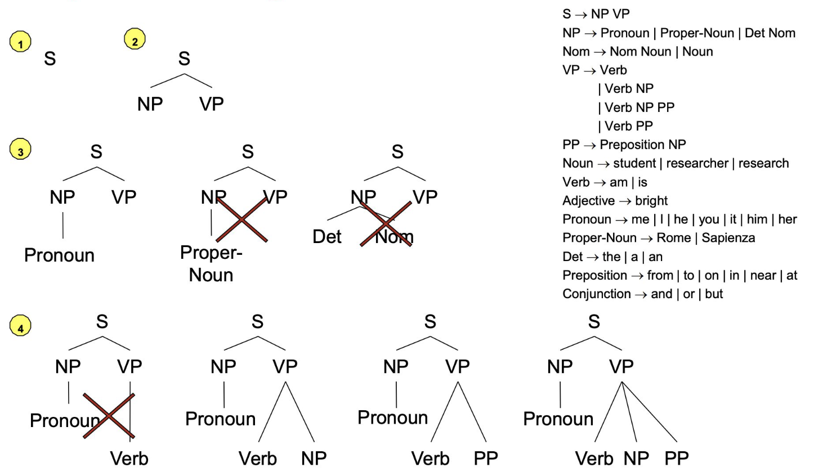
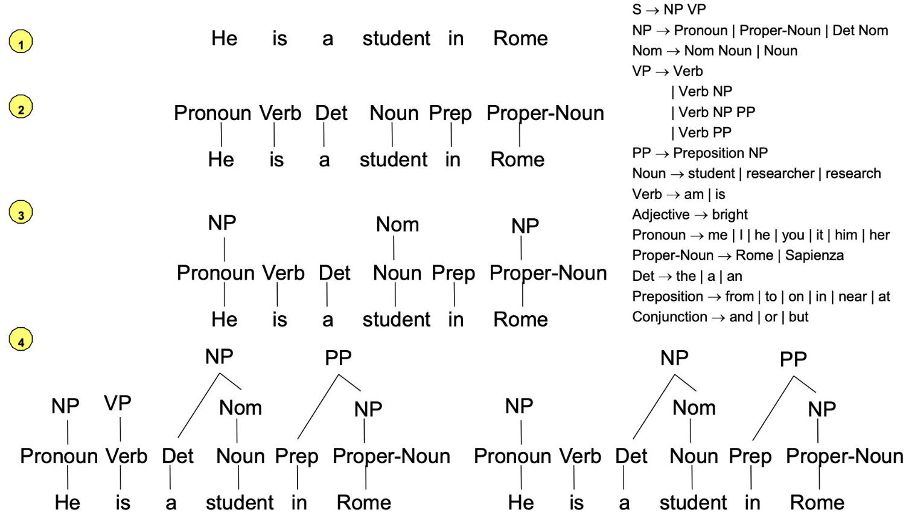
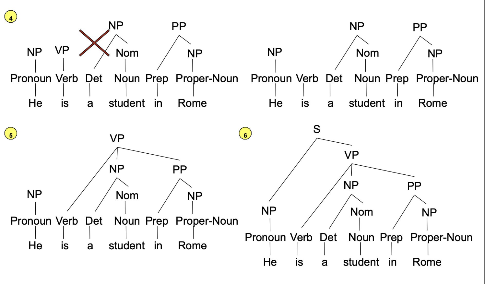
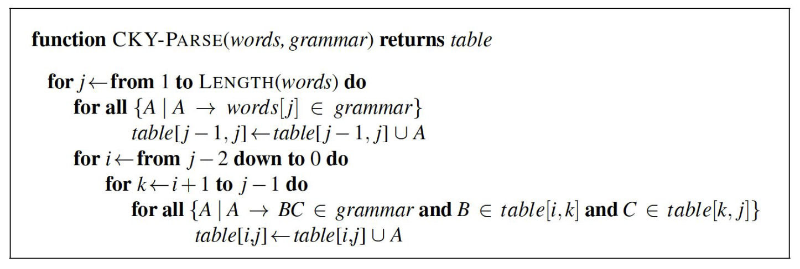
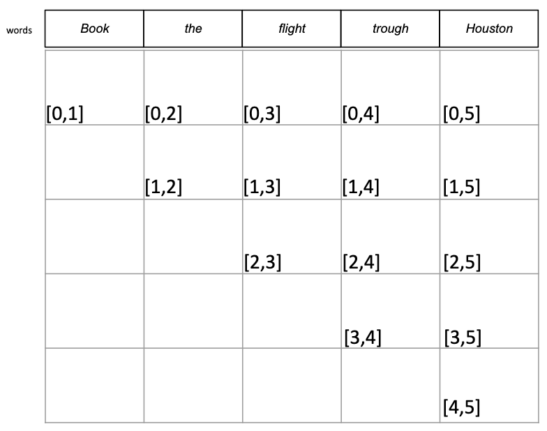
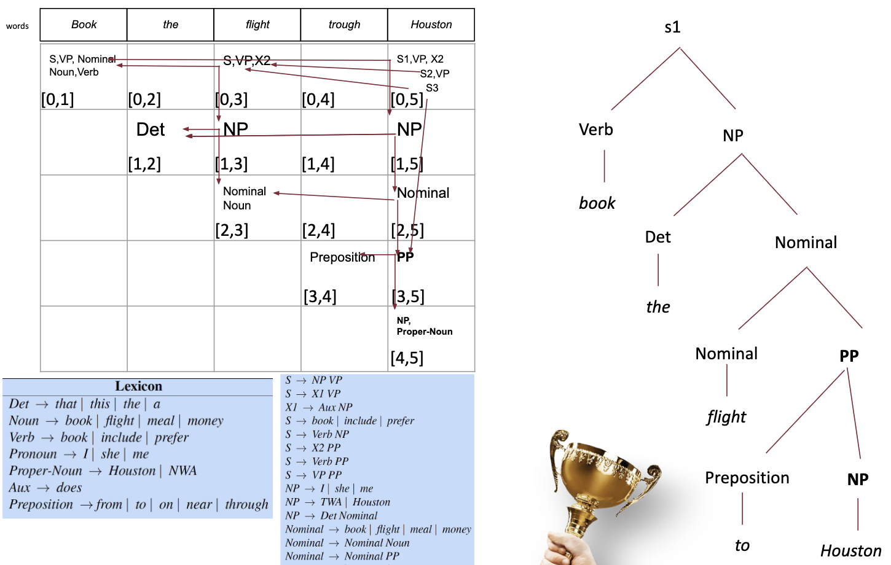

# Speech tagging 

### Exercises

List of exercises:
- Syntax tree (not in exam)

### Recall questions 

1. 

 What is a straightforward way of handling the syntax of a a sentence? Why it might not be ideal when applied to every language?  

    
    \
    We can try to express every sentence of a language with the help of a ==context free grammar==: 

	To make things even easier, we can use a ==CFG in Chomsky Normal Form (CNF)==, as it has the advantage of ==generating a binary tree==: 

	Most languages however have ==flexible word ordering==: this makes creating a CFG really hard. 

2. 

  What are dependency grammars? How do they help in addressing the issue mentioned previously? 

    
    \
    Dependency grammars express ==lexical, semantic or syntactic relations between words==.

	These grammars have the advantage of ==being word-order free==, whereas a normal CFG would need specific rules for each position of, say, a certain verb: 
   

3. 

 What is a treebank? What it is used for?  

    
    \
    A treebank is a ==corpus whose CFG parses are annotated with dependencies==. The idea is to ==use it as a black box to annotate new pieces of text==: 

4. 

 Describe two common strategies for parsing dependencies. What is the main issue of both approaches? 

    
    \
    Two strategies:
    - ==top down parsing==: 
    - ==bottom up parsing==:  

	The issues is that ==both strategies potentially require a considerable degree of backtracking==. 
   

5. 

 What is an alternative strategy to perform parsing more efficiently? Describe the CKY algorithm. 

    
    \
	An alternative strategy for parsing is ==dynamic programming==, which saves ==intermediate parsing steps== in a table to avoid computing them again.

	The CKY algorithm uses DP to parse a ==sentence given a CFG in CNF==: 

	Starting from a table like the one in the following image, ==the sentence belongs to the grammar if the cell $(0,n$ contains the starting symbol==: 

	In the end, the parse tree can be build by ==backtracking through pointers==: 

6. 

  What is the main "issue" of parsing a sentence using the CKY algorithm? 

    
    \
    The main issue is that ==parsing is ambiguous==: taking different paths through the back-pointers could lead to multiple legal parses of the same sentence.

