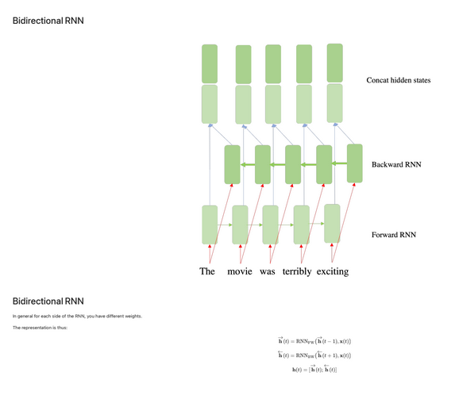
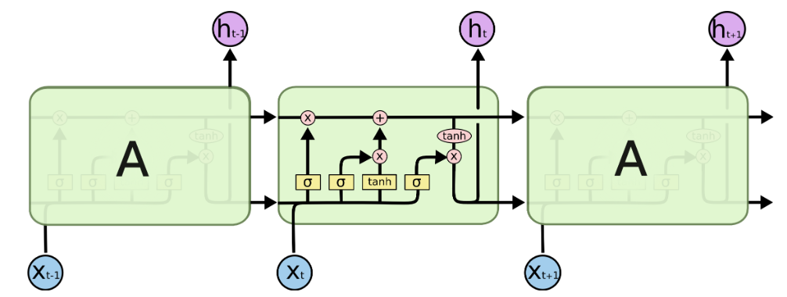
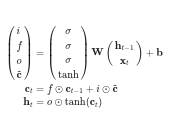
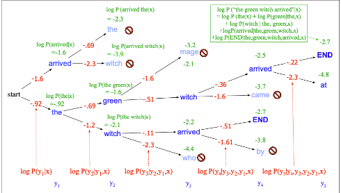
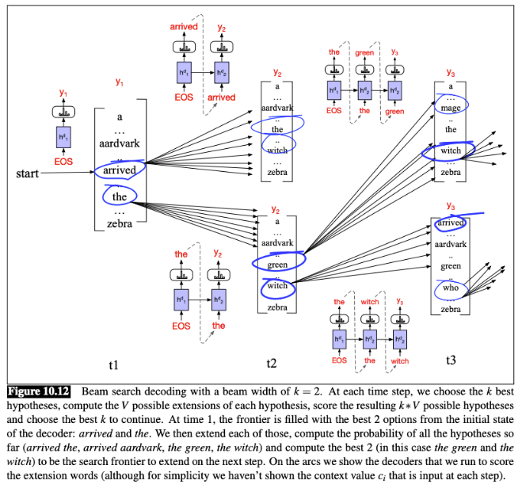

List of exercises:

Also see
- [[AML V - Sequence models]]
- [[AML VI - Transformer networks]] 

For a clearer explanation on Inverse Transform Sampling, see: https://www.youtube.com/watch?v=9ixzzPQWuAY

### Recall questions  on RNNs

1. 

 What is the idea behind bi-directional RNN? Is it suitable for every task? 

    
    \
	In some cases it is useful to have bi-directional RNN in order to ==leverage important context information==. A great example would be sentiment analysis.

	
   

2. 

 What is a popular model that uses a concept similar to forget gates? 

    
    \
    ==CNNs with skip-connections==.
    

## Recall questions on LSTM

1. 

 Explain how the LSTM model works. What is the role of each gate function?  

    
    \
    LSTM model recap: 

	The equations for the model can be summarised as: 
    

### Recall questions on NMT

1. 

 Why is greedy decoding ineffective? Describe a better alternative. 

    
    \
    The main issue of greedy decoding is that since ==we take the word with the highest probability as the next prediction==, we ==never evaluate other choices== that could lead to a higher likelihood (thus maybe to a better decoding).

	We can however apply a solution which is kind of in between a greedy search and an exhaustive search: a ==beam search==.

	The main idea is that we want to explore $k$ hypothesis at the same time, as shown here:

	

	However, we only examine a part of all the possibilities, as shown in this beam search decoding example: 

	
   

2. 

 How do we decide when to stop the sentence when using beam search? And how do we choose which sentence to use as translation? 

    
    \
    We can terminate on 2 conditions:
    - we generate and ==$<END>$ token== - note that this may happen at ==different sentence lengths==;
    - we reach a ==predefined cutoff==, i.e. a time ==step $T$==.

	To decide which sentence we will consider as our translation, we score them considering their ==log-likelihood normalised by sequence length==, to avoid creating a bias towards shorter sentences: 

	
   

