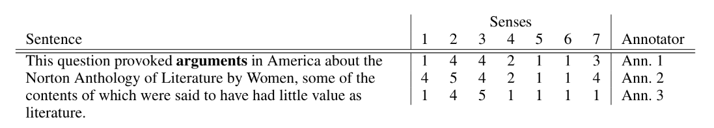

### Exercises

List of exercises:

### Recall questions 

1. 

 What  is syntax driven semantic analysis? What is a possible solution to implement it?  

    
    \
	As the name suggests, it is a kind of ==semantic analysis driven by syntax==: 

	One possible solution is to ==augment CFGs with semantic meanings, using first order logic==.

2. 

 How can we use lambda calculus to further generalise semantic analysis? Why it is, again, kind of unfeasible?  

    
    \
    Lambda notation can be used ==to abstract from fully specified FOL==, creating rules that can generate new FOL expressions:

	

	This technique, however, has 2 drawbacks:
	- it is ==difficult== to perform
	- ==assumes that each terminal has just one meaning==
    

3. 

  Describe the idea behind lexical semantics. 

    
    \
	The idea of lexical semantics is to ==concentrate on the single words and to understand their meaning==

4. 

 What are word senses? Does a word have just one sense?  Why is choosing the right word sense difficult? 

    
    \
	The term ==word sense is a synonym for word meaning==. Each word can have ==multiple senses==. Choosing the right sense is often complicated by numerous factors:
	- homonymy
	- metonymy 
	- metaphors
	- personification
	- and so on...

	We'll thus ==first focus on how to represent word senses, and then on how to disambiguate==. 

5. 

  How can we represent word senses? Describe the various strategies. 

    
    \
	To describe word senses, we have various strategies:
	- ==enumeration==: using a ==sense inventory== to store all possible meanings and using the ==words in the context to activate one of them==: 
	- ==graded word senses==: use ==annotators to create generative rules== to describe the senses (similar to PoS tagging): 
	- ==computational lexicons==: ==machine readable dictionaries==

6. 

  What is WordNet? Why is it more than a simple graph? 

    
    \
    WordNet is a ==computational lexicon of English==, expressing each ==word as a synset (group of synonyms)==. On top of that, each word is connected to the others via ==lexical and semantics links==, creating a graph that is effectively a ==semantic network==.

	

7. 

 What is BabelNet? How does it "extend" WordNet?  

    
    \
	BabelNet is another ==computational lexicon==, however it is ==multilingual== and it includes multiple sources: 

8. 

 What is word sense disambiguation? 

    
    \
    Given ==a word in context and a fixed inventory of possible word senses==, the goal is to ==decide the most suitable synset== if there is one.

9. 

 What is entity linking?  

    
    \
    Entity linking is the ==task of assigning a unique identity to entities== (such as famous individuals,  locations, or companies) mentioned in text: 
	

7. 

 

    
    \
	

