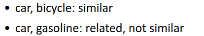
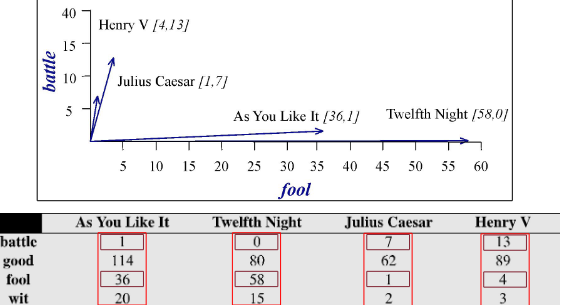
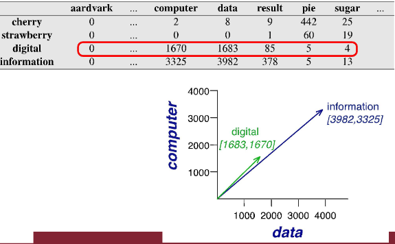
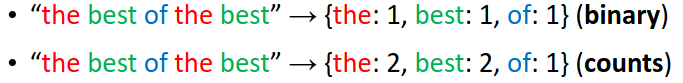
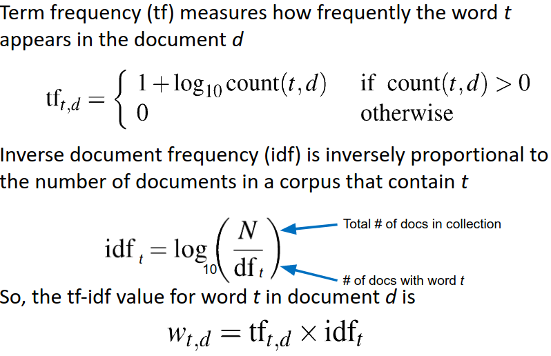
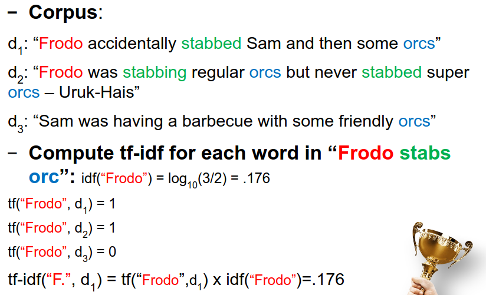
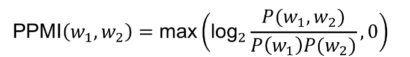
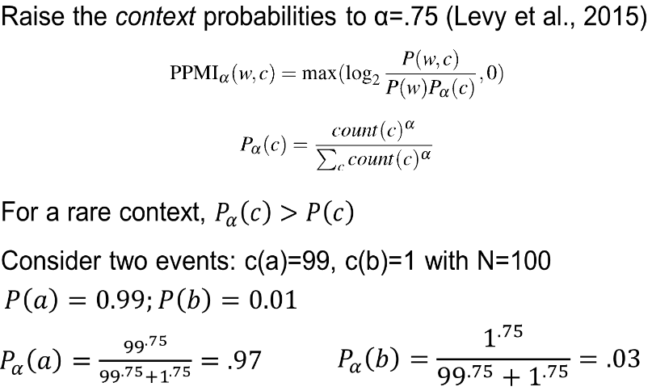

Also see [[BD VI - Dimensionality Reduction]]
### Exercises

List of exercises:
- TF-IDF
- PPMI

### Recall questions 

1. 

 What is the difference between world similarity and relatedness? 

    
    \
	Similarity is used to refer to ==words with similar meaning==, while relatedness for ==words that are generally associated together==.

	

2. 

 What is the distributional hypothesis? 

    
    \
	The distributional hypothesis says that ==similar words tend to appear in similar contexts==.

	This can be also interpreted as ==word co-occurrences reveal meaning and semantic relations==. 

3. 

 What is the main idea of vector semantics? How do we call these vectors? How many "types" of embeddings exist? 

    
    \
    VSMs are models ==focused on word similarity==, representing each of them ==as a vector (point)== in a space. This definition makes similarity easy to define, as ==words with the same meaning appear close in space==.

	Words embedding, which ==are infinite==, can be either ==sparse or dense==.

4. 

 What is a term-document matrix? And a word-word occurrence matrix? 

    
    \
	Example of term-document matrix and the representation built from it: 

	Example of word-word occurrence matrix and a possible representation built from it:  

5. 

  What is a bags-of-word model? Why it is a "better" than the previous representation? 

    
    \
    Bag of words are ==real valued multi-sets of words==, which basically means a short form for representing the vectors we were talking about: 

	This makes it ==more compact than the previous representations==.

6. 

 What is TF-IDF? 

    
    \
    It's a measure that ==promotes document-specific words, penalise non-specific words==: 

	Note that ==term frequency is computed on a per document basis, while the $idf$ is computed across all the documents==.

	An example: 

7. 

 What is Point-wise Mutual Information? What is the main issue and how is it solved? 

    
    \
    It's a metric used to ==measure the co-occurrence of words by looking at the probability of a context word and a target word appearing together==. 

	In practice, ==Positive PMI== is used to handle possible ==negative values in the $log$== (i.e. words appearing together with a $p$ smaller than chance): 

8. 

 What is a side-effect of PPMI and how do we fix it?  

    
    \
    PPMI ==tends to overestimate infrequent events==, so we can either:
    - apply ==smoothing (e.g. laplacian)==, also seen in [[NLP IV - Syntax]]
    - tweak the formula, like in the example here: 

