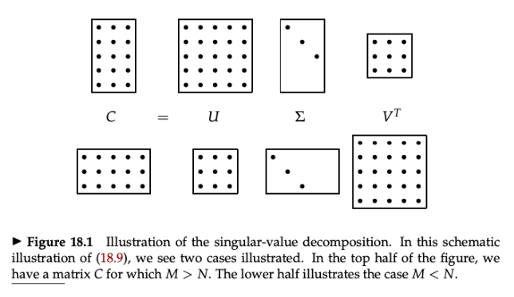

Also see;
- [[BD XII - Recommender Systems]]
- [[BD VI - Dimensionality Reduction]]
- [[FDS IV - Classification]]
### Exercises

List of exercises:
- computing loss for word2vec with skipgram

### Recall questions on LSA

1. 

 Briefly introduce 2 well-known compact word representations. 

    
    \
    Two compact and short representations:
    - ==latent semantics analysis==
    - ==word2vec==
	

2. 

 Describe the key step of LSA. What are 2 key assumptions that we make? 

    
    \
    We start with ==$X$,  a term document matrix or tf-idf matrix over a corpus with dimension $|D| \times |V|$==.

	We make ==2 key assumptions==:
	- there are ==$k$ hidden topics that we have to discover==
	- we ==can model a decomposition of $X$== so that it ==forces some constraints and retains information about the data==

	To decompose ==$X$, we'll use $SVD$, a.k.a. singular value decomposition==.

3. 

 Describe the steps of SVD used to decompose the matrix previously mentioned. What is the point of the main constraint? 

    
    \
	We decompose $X = USV^T$:
	$\mathbf{X} \in \mathbb{R}^{|D| \times |V|} \qquad = \qquad {\mathbf{U} \in \mathbb{R}^{|D| \times |D|}, ~~\mathbf{S} \in \mathbb{R}^{|D| \times |D|},~~ \mathbf{V} \in \mathbb{R}^{|D| \times |V|}}$
	
	$\begin{equation} \begin{aligned}\arg\min_{\mathbf{U},\mathbf{S},\mathbf{V}} & \left\|\mathbf{X}-\mathbf{U S V}^{\top}\right\|_F \\\text { s.t. } & \mathbf{U}^{\top} \mathbf{U}=\text{Id} \\& \mathbf{V}^{\top} \mathbf{V}=\text{Id} \\ & \mathbf{S}=\text{diag}(\lambda_1,....\lambda_s) \end{aligned}\end{equation}$

	This can be visually represented as 

	Where:
	-  ==$U^T U  = Id$ is the ortho-normality constraint==: all pairs of ==dimensions in U and V are uncorrelated, so that each dimension conveys  unique information==;
	- ==$S$ is a diagonal matrix containing the ordered singular values==, denoting the ==importance of each axis in the new space==.

	This decomposition, however, ==does not model our $k$ hidden topics yet==.

4. 

 How can we model the K hidden topics of our matrix? 

    
    \
    To model the hidden topics, we use ==truncated SVD==: we only consider the ==highest singular values (i.e. top-$k$, similarly to PCA)==.

	
	

5. 

 How can we use this newly found topic matrix (k*k)? 

    
    \
    We can use our decomposition to:
    -  plot the ==vocabulary in the embedding space== to ==study the similarities== 
    - ==plot words in term of relatedness to a certain topic==, looking at the $k$-th column of $V_k$: 
    - ==project a document into a lower dimensional space==: $d_k = V_{k}^{T} \cdot d$
	

6. 

 What are the main issues of SVD?  

    
    \
    Main issues of SVD:
    - the ==matrix is extremely sparse since most words do not co-occur==
    - the ==matrix is still high-dimensional==
    - SVD has ==quadratic cost==

### Recall questions on Word2Vec

1. 

 What is the setup for word2vec?  

    
    \
    Given a ==corpus $V$, each word of the corpus is associated to a 100 dimensional vector==. The model's parameters ==$\theta$ depend from  all the $|V|$ vectors.==

2. 

 What are the parameters of the word2vec model?  What is the total number of parameters? 

    
    \
    2 parameters to learn: 
    - ==$\theta_W$, a matrix $|V|\times D$== that stores the ==embedding of each word when we consider it as a center==;
    - ==$\theta_C$, a matrix $|V| \times D$== that stores the ==embedding of each word when we consider it as a context==.

	Thus, the ==total parameters are $2 \cdot |V| \cdot D$==

3. 

 Describe the pre-text task for training the skip-gram word2vec.   What is a key strong assumption? 

    
    \
    Given a window size of $m$, say 2, we select:
    - the ==center word $w_t$==
    - ==$m$ words of each side== as the context, i.e. $w_{t+1}, w_{t+2}$ and $w_{t-1}, w_{t-2}$.

	The goal is to ==maximise the likelihood $p(w_{t-2}, w_{t-1}, w_t, w_{t+1}, w_{t+2} | w_t = word; \theta)$==.

	To simplify things, we assume ==conditional independence==: $p(w_{t-2}, w_{t-1}, w_t, w_{t+1}, w_{t+2} | w_t = word; \theta) \approx \prod_{-m, \leq j \leq m} p(c_{t+j} | w_t; \theta)$

4. 

  How do we compute the "individual" probabilities? 

    
    \
    First we ==compare the embedding of $w$ as a center word in position $i$== (same position as in the vocabulary $V$), computing: 
    
    This ==vector $z$ is comprised of logits encoding the similarity between $w$ as a center and the other context words.==

	Then, we ==pass $z$ through a softmax== to obtain actual probabilities $p = softmax(z$).
    
	

5. 

 How do we effectively train the skip-gram model?  What is the final loss formula? 

    
    \
    We ==compare the vector $p$ with a one-hot encoding vector== with a 1 in place of the correct prediction (i.e. masked word). We train the model ==optimising the cross-entropy loss==.

	The final loss formula is: 

	After the training is complete, we'll end up with many vectors that can be used as embeddings.

	For full details on training see slides nr. 13.

