Also see:
- [[NLP VII - Latent Semantic Analysis and Word2Vec]]
### Exercises

List of exercises:
	- TBA

### Recall questions 

1. 

 What is the main difference between word2vec trained with skip-gram vs continuous bag of words? Which simplification is applied? 

    
    \
    In continuous bag of words, ==the context is now used as the conditional part of the probability==. Furthermore, the ==context is now an average== of each context word: 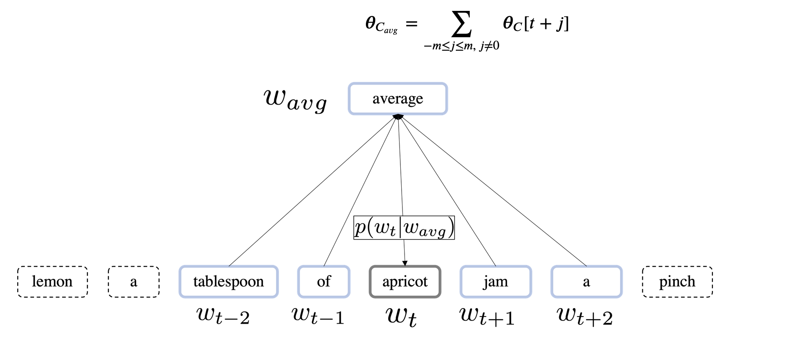

	The process is kind of swapped w.r.t. to the skip-gram training: 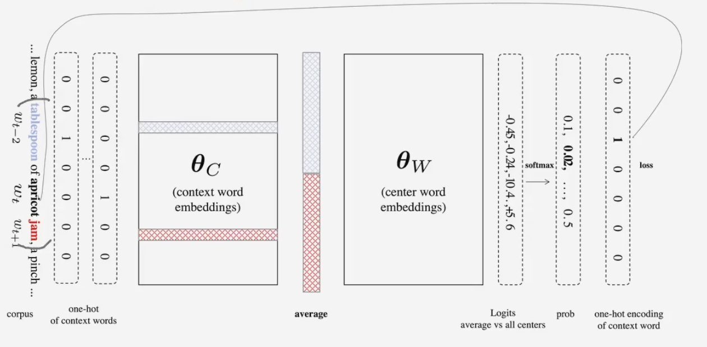
   

2. 

 What is the computational complexity of standard word2vec? How can we make it better?  

    
    \
    Standard word2vec has to ==compute a denominator in the order of $O(|V| \times D)$==. This makes it very expensive: 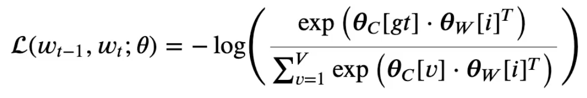

	There are 2 ways of making it faster, by ==approximating the denominator==:
	- ==negative sampling, a contrastive method==;
	- using a ==hierarchical softmax, a tree based method==.
   

3. 

  How is the denominator approximated in SGNS? And how does the likelihood/loss change? 

    
    \
    We now ==sample $k$ words from $V$, and compare them with the center==: 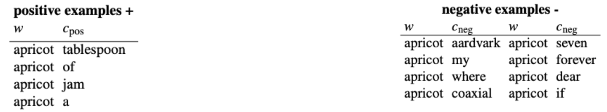

	We now ==compute the likelihood (log likelihood) using a binary classifier that outputs a probability $\in \{0,1\}$== (sigmoid) with the ==dot product given as input==: 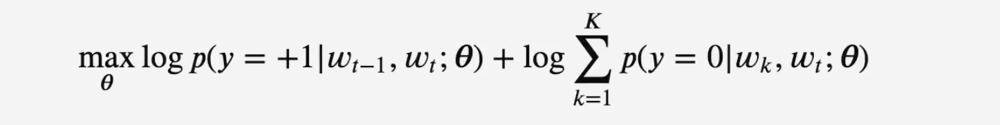 
	
	becomes
	
	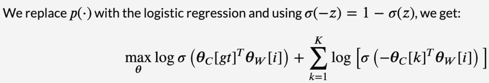

	When ==minimizing==, we use: 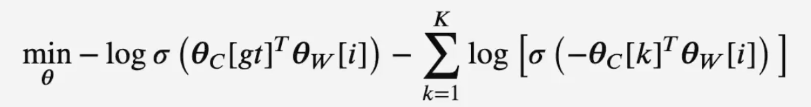
   

4. 

  How do effectively sample the k negatives? How does this affect the gradient? 

    
    \
    We sample them from a ==univariate distribution== based on a ==previously trained unigram model==: 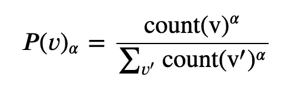

	Note that sampling makes the ==gradient matrix very sparse: this can help in optimizing updates, as we'll only update the index of the sampled context words.==

	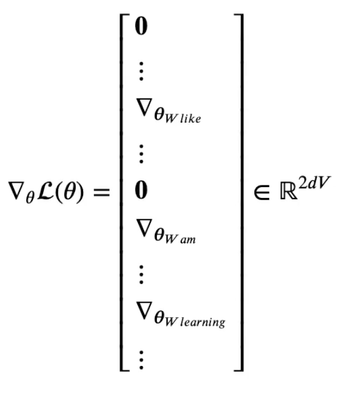
   

5. 

 Explain what a hierarchical softmax is. What is the inspiration for it? What changes in the model?  How many parameters do we have? 

    
    \
    A hierarchical softmax ==leverages huffman trees to model the vocabulary $V$==. In fact, our parameters ==$\theta$ now model the internal nodes of this tree which are $V-1$.==

	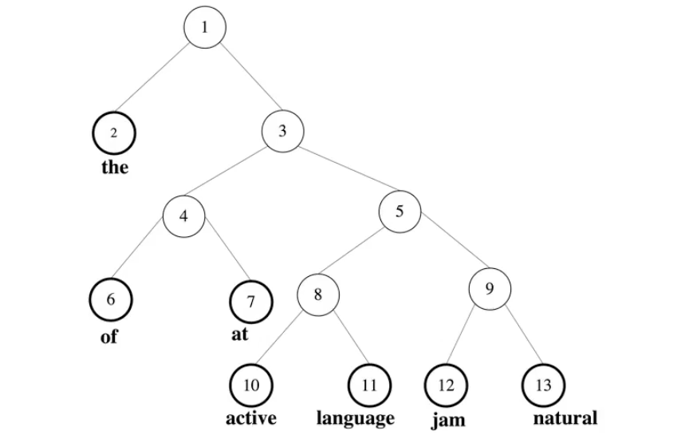

	<small> In the example the context is language and the word to predict is natural </small>

	==Each node is paired with a context/center feature vector to be learned, making the total number of parameters $2V-1$.==
   

6. 

  How does training change when a hierarchical softmax is used? What is the main issue at inference time? 

    
    \
    The ==probability for a prediction is computed following a path to the word== we have to predict: 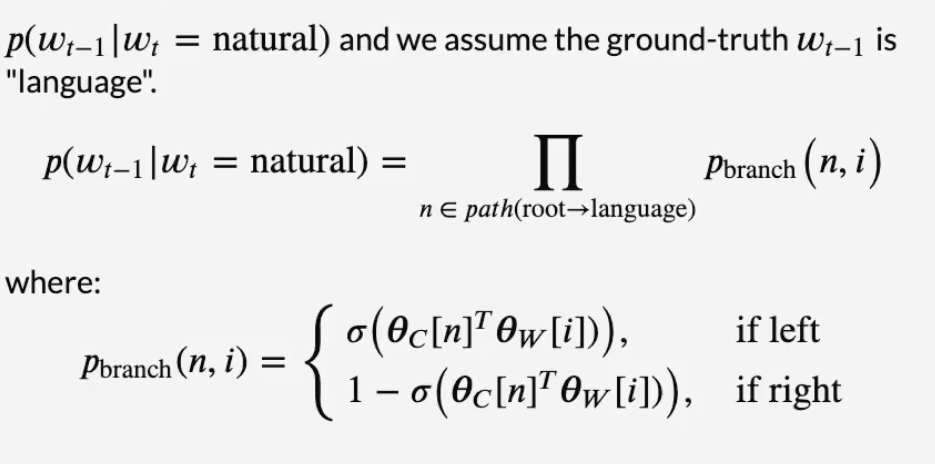

	For example, the probability is effectively computed as shown here: 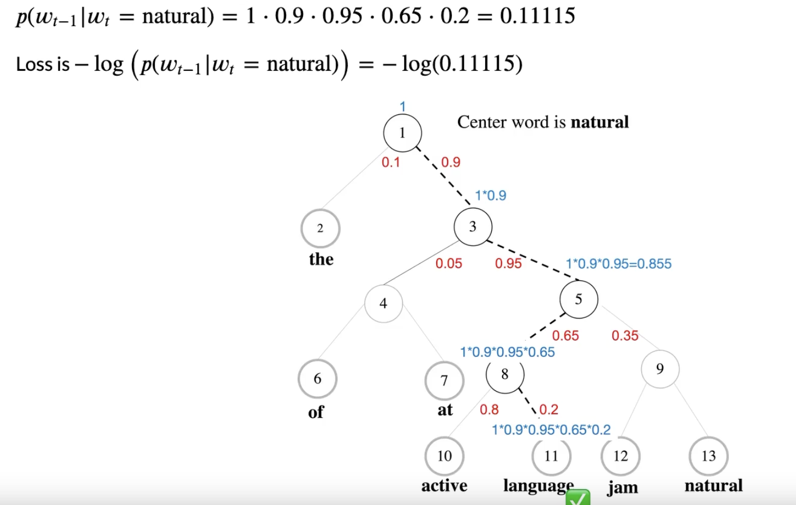

	At inference time, since we do not know the word, we use ==beam search==. Alternatives like ==extensive search or greedy search== are rarely used.
	

1. 

  

    
    \
   

