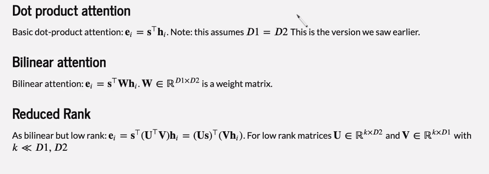
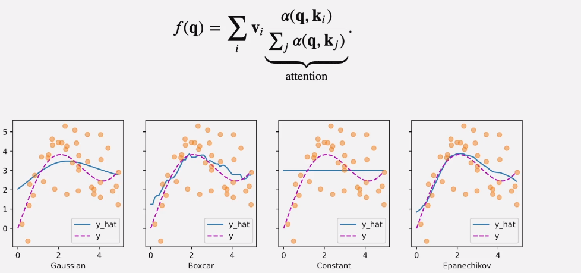
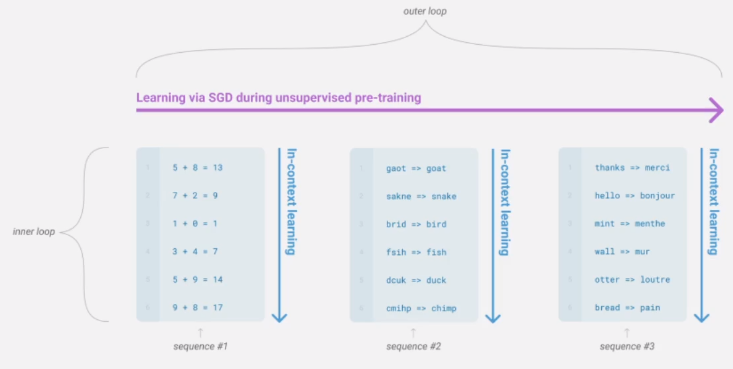

Also see:
- [[AML VI - Transformer networks]]

Exercises:
- [x] transformers dimension check
### Recall questions on transformers 

1. 

  Describe the main limitations of recurrent models before transformers.

    
    \
    Two main issues:
    - ==linear time dependency==: two words require $O(T)$ time steps to interact, where $T$ is the sequence lenght;
    - ==lack of parallelisation==: $O(T)$ non parallel steps for each sequence.
    

2. 

 What is a possibile alternative that uses an architecture already tested on images? 

    
    \
    We can use ==convolution==, as shown in the linked notes under the section "temporal convolution":  [[AML V - Sequence models]]
    
   

3. 

  Give a brief list of popular attention forms.

    
    \
    Attention types: 
   

4. 

  Describe a classical ML problem in which attention was first seen and why it is relevant.  

    
    \
    First seen in ==Nadaraya-Wattson regression== (with various kernels for attention):
    

	The point is: why not ==learn the kernel (attention)== instead of manually tuning it?

5. 

 What happens to the output of each self-attention module? 

    
    \
    A ==feed forward neural network is applied to each vector in output
   

Also see from the other notes:
- positional encoding
- masked self attention
- multi-head attention (cutting dimensionality)
- scaled dot product
- layernorm

### Recall questions BERT, pre-training

1. 

  Which type of encoding is used in transfomers used for NLP? Why? 

    
    \
	==Sub-word encoding== like byte-pair encoding are used. This allows for better representation of ==infrequent words and typos==.

2. 

  What are possible ways of pre-training a transformer model for NLP tasks? 

    
    \
    Three main modalities:
    - ==decoder only==: i.e. predicting the future words given the past tokens, like in classica language models;
    - ==encoder only==: also receives context from the future;
    - ==decoder+encoder==
   

3. 

 What are the fine-tuning strategies linked to the previous pre-training modalities? 

    
    \
    In case of decoders, we either ==classify== or train the model to do ==summarization/generate dialogue==.

	In case of encoders, we can used ==masked word prediction==, as seen in BERT (see linked notes.)
   

4. 

 What approach was used by GPT2? And GPT3?  

    
    \
	A more general approach is the one proposed in  ==GPT2, labelling sentences to determine whether they are contradicting or not.==

	> Example: The man was in front of the door // The man was in the doorway

	==GPT3 used in context learning==: 

