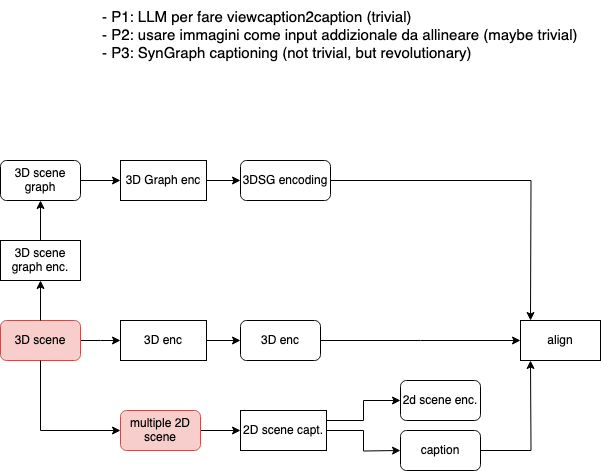

# 3D Scene contrastive pre-training

This includes:
a) the tentative title
b) the tentative abstract: apart from promising good results, this expresses the relevance of the idea, the current gap in the field, the way this idea fills it, what is implemented as part of the idea, where it is tested
c) one-sentence catchy summary: in a nutshell, in a single simple sentence, the very reason why this paper should be accepted
d) related work summary: if you are pondering on the idea, the first important check is related work, to scout how to best pitch it, in what sweat spot it fits
e) originality: one crucial point for any ECCV submission. Have your points of originality ready to be challenged
f) contributions, as a tentative list

Feel free to include any visual illustration/slides/docs/papers which makes the point.

Let's target 5 minutes maximum for the presentation and 5 minutes maximum for the discussion. Further discussions should be continued offline by the participating team.

### Title & Idea in a nutshell

Multimodal contrastive pre-training for text to 3D scene generation

### Abstract

### Main idea

Apply the following pipeline:

With a decoder on top to generate detailed 3D scenes starting from a textual prompt:

### Relevant literature

Tentative reference:
- Point E: https://arxiv.org/pdf/2212.08751.pdf

### Contributions

We introduce a contrastive pre-training framework to generate high fidelity 3D images starting from a textual prompt.

