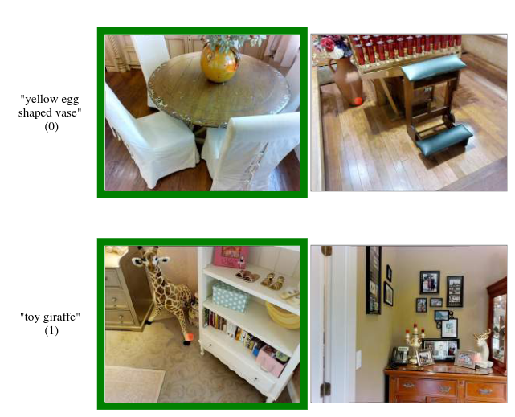

## 3D Scene contrastive pre-training with 3D scene graphs

### Title & Idea in a nutshell

Keywords: Contrastive learning, 3D scene graph, 0-shot, Self-Supervision/Unsupervised Learning
### Abstract

We propose to improve existing scene understanding techniques with the help of scene graphs which can model high level semantic features.
### Main idea

We want to use 3D scene graph to aid the processing of a three-dimensional scene. The idea is to leverage high level semantic features coming from a 3D scene graph to enrich the final scene embedding. 

Normal multi-modal contrastive pipelines focus on aligning different modalities of data, i.e. text, images, point clouds/meshes/nerfs. In the case of 3D and 3D scenes, pretrained state of the art models on text&image are leveraged; the assumption is that the huge amount of data on which they are pretrained is enough to implicitly model the semantics of a scene.

This pipeline, however, *might not capture enough information related to the relationships between objects*.  This might be especially true for downstream tasks in which the goal is to understand the semantics of the scene (**segmentation**) or retrieve particular items (**retrieval**). 

Example of a typical query: 

Starting from an existing state of the art model, called OpenScene (2023), we substitute the step which processes image features. We propose to replace it with a module to process features from a 3D scene graph computed from the original scene. 

An example of a 3D scene graph from **3D Scene Graph, Stanford**  is:  

Ideally, the 3D scene graph can be processed in 2 steps:
- GCN with message passing, to process local and global features of each node/connection
- LM (e.g. CLIP textual encoder) to process node/object descriptions and attributes

The final features can be then aligned/merged **per point** to create an augmented point cloud useful for segmentation, understanding or/and retrieval. 
### Contributions

Contributions:
- addition of a ad-hoc module for understanding the structure of a scene (scene graph)
- remove the need for processing images (?)
### Relevant literature

Tentative reference list:
- **OpenScene: 3D scene understanding with open vocabulary**:
	- paper: https://arxiv.org/abs/2211.15654
	- code: https://github.com/pengsongyou/openscene
- **3D Scene Graph: A Structure for Unified Semantics, 3D Space, and Camera**:
	- paper: https://3dscenegraph.stanford.edu/images/3DSceneGraph.pdf
	- code: https://github.com/StanfordVL/3DSceneGraph
- **Hydra: A Real-time Spatial Perception System for 3D Scene Graph Construction and Optimization**:
	- paper: https://arxiv.org/pdf/2201.13360.pdf
	- code: https://github.com/MIT-SPARK/Hydra

