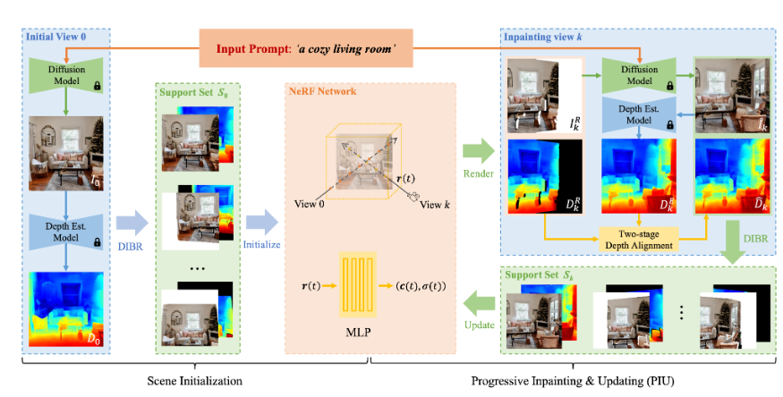
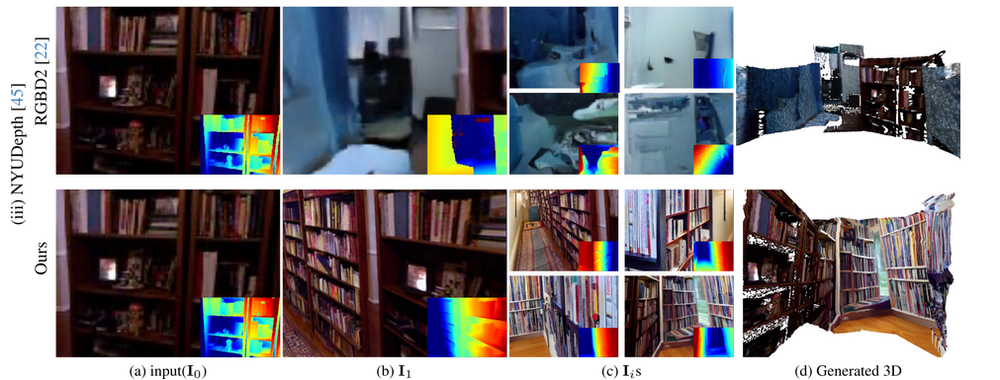

## Text to scene generation with Humans (?)

### Title & Idea in a nutshell

Keywords: 3D scene,generation
### Abstract

We propose a pipeline for generating ...
### Main idea

Generate entire 3D scenes from a single textual prompt. Existing state of the art models produce either high quality scenes at the cost of performance:

Or introduce more efficient methods that result in a final inferior product:

Possible "attack vectors":
- improve final representation quality while improving performance (really hard, need to create a new model?)
- introduce other elements in the mix, i.e. generate scenes and populate them with humans
- ??
### Contributions
### Relevant literature

Tentative reference list:
- **Text2NeRF: Text-Driven 3D Scene Generation with Neural Radiance Fields**:
	- paper: https://arxiv.org/abs/2305.11588
	- code: TBR
- ** LucidDreamer: Domain-free Generation of 3D Gaussian Splatting Scenes**:
	- paper: https://arxiv.org/abs/2311.13384
	- code: https://github.com/luciddreamer-cvlab/LucidDreamer