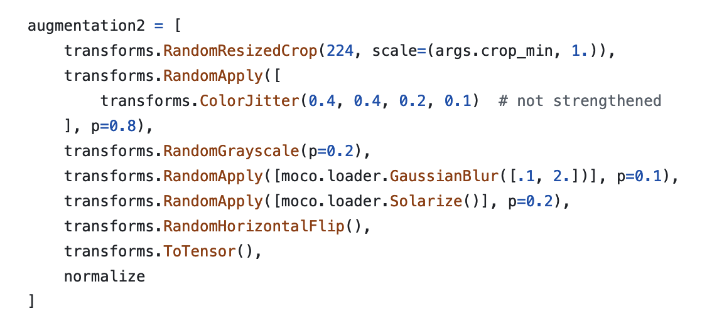
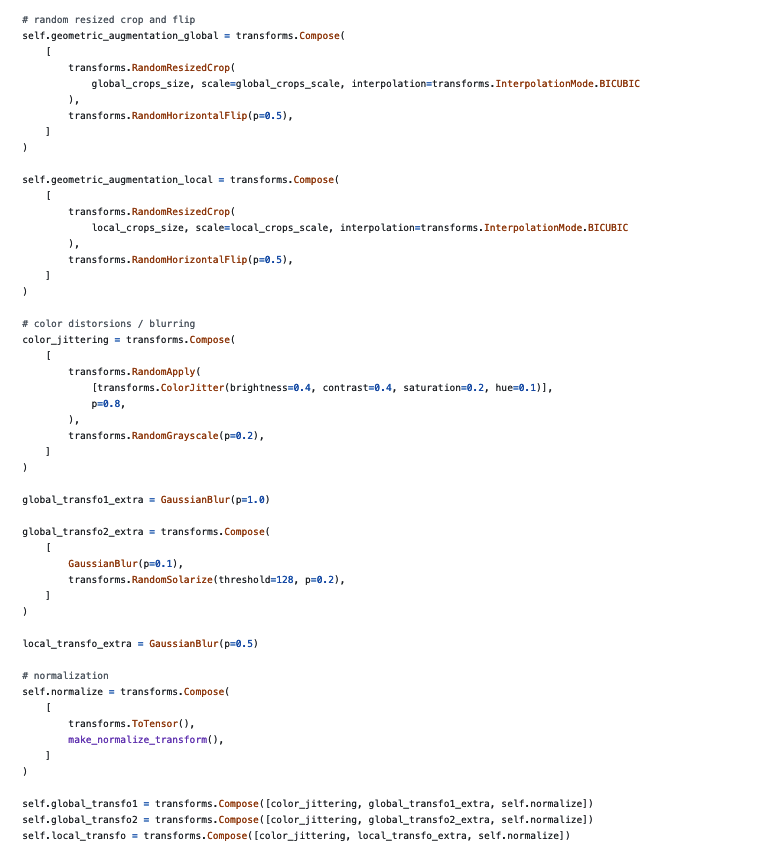

# Resources

## Literature

### Moco v3

Augmentation policy: take two crops and apply the following augmentations. Note that aug1 does not have Solarize. This augmentation policy is similar to what is applied on BYOL

### Dino v2

Augmentation policy: feed student and teacher with two different views, according to the Self Distillation pipeline.

