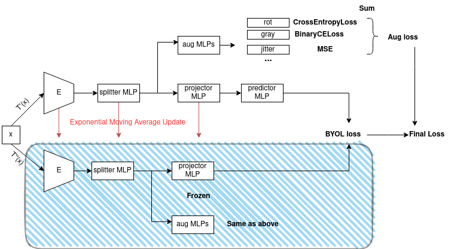

# To discuss

## 1. Where we left off

Stage 1 implementation terminated, Stage 2 under construction. Need to **evaluate Stage 2 results** to figure whether the **idea is sound**. **Stage 1 results are promising**, although we spent a lot of time on it.

## 2. Where we are

Stage 2 **implementation completed**. Tested multiple variations of Stage 2, pictures attached:

In addition to the loss, we also apply a **reconstruction loss** w.r.t. the augmented images, i.e. we start we the original image (not augmented) and apply augmentations to it. We then apply MSE to the recon'd image and the augmented image originally in input. Note that **the augmentations are deterministic**, to ensure that the recon loss is as correct as possible.

We also examined other variations:
- lower part of model augmentation prediction contributes/does not contribute to loss
- splitter at the end, in the middle, no splittter
- replicate E output, then pass half of the output to prj and half to an MLP to re-elaborate features for aug predictions (more similar to BYOL)
- only lower part of model predicts augmentations
- unfreeze aug MLP in lower part of the model to update faster

## 3. What we found out

First, we reproduced baselines. The original code is not in torch, so we had to rewrite it. We obtained the following results in top-1 acc w.r.t. to the original baselines:
- Imnet1K: **original** 74.3% **reproduction** 69.7% (-4.6%)
- Imagenette: **original** 92.3% **reproduction** 90.5% (-1.6%)

We believe that despite the slight discrepancy (probably due to porting the code) the main BYOL pipeline was correctly reproduced.

Main discoveries:
1. **Augmentation MLP effectively predicts augmentations** values
2. We actually achieve a **validation contrastive loss lower than BYOL**, despite the augmentations

Issues, criticalities:
1. Performance slightly lower than baseline
2. Despite the lower validation contrastive loss, the model struggles more on the downstream task --> **discuss possible explanations**
3. Not explored any other downstream task, as classification performance is already lower than baseline

## 4. Possible next steps

Possible next steps:
1. More debugging/thinkering with BYOL
2. Migrate to other base model. Best candidates are VAEs, VQ-VAEs, transformers
3. Migrate to other contrastive framework, ex. MoCoV3 ( negatives could help against overfitting?)

## 5. Q&A