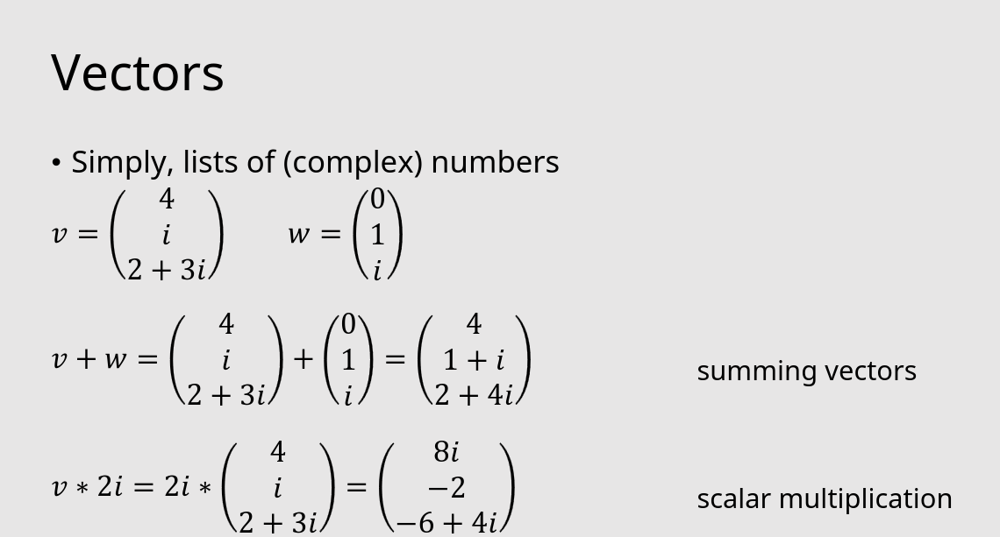

# Lecture 1

### Recall questions

1. 

 Basic operations on complex numbers  

    
    \
    List of basic operations: 
     
     For complex division ==multiply both for the conjugate of the divisor==. 
    

2. 

 Plotting complex numbers in normal and polar coordinates 

    
    \
    Plotting in normal coordinates: 
    
    Plotting in polar coordinates: 
    

3. 

 Conversion in polar coordinates is handy 

    
    \
    How to do the conversion: 

     Why it is handy: 
    

4. 

 Vector of complex numbers and norm 

    
    \
	  Vectors are defined as: 

	  And the norm is defined as:  
    

5. 

 Matrices of complex numbers 

    
    \
    Product: 

	  Matrix times scalar: 
    

6. 

 Eigenvectors and eigenvalues of complex matrices 

    
    \
     Quick recap: 

	  Note that in ==general both $v$ and $\lambda$ are complex==.
    

