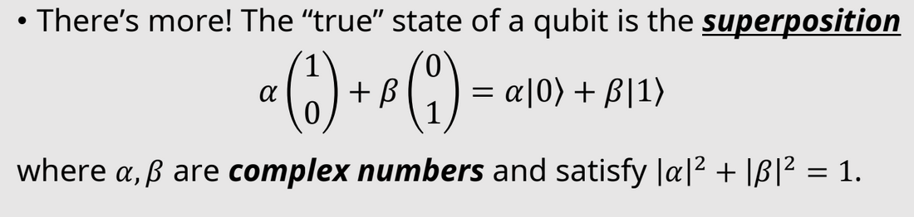
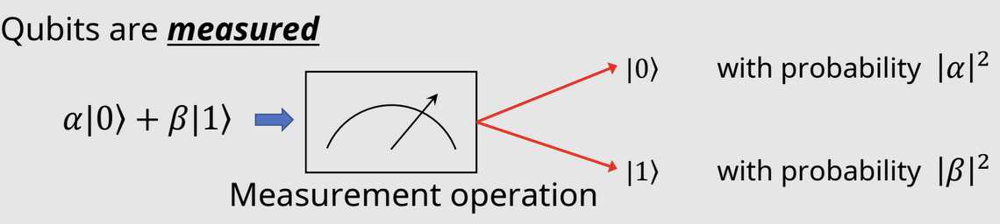

# Lecture 2

## Part One

### Recall questions

1. 

 Are quantum algorithms probabilistic? How is randomness generated?  

    
    \
	    
	    Randomness is implicit to quantum computers, no need for PRGNs.

1. 

 What is the state of a qbit? What is the true state?  

    
    \
	    
		 Note that the ==true state of a qbit cannot be observed==.

1. 

  How is one able to find the content of a qbit?  

    
    \
	    
	    Note that ==once observed, the state of the qbit is going to be fixed to be either ..==
    

1. 

  Give a small proof of why it is hard to know alpha and beta (superposition coefficients). 

    
    \
    

1. 

 Are quantum transformations linear? What does this imply?  

    
    \
    

1. 

  Describe the Pauli matrices used in Qbit gates 

    
    \
    

1. 

 What is the Hadamard matrix and why is it useful? Can you think of a practical application?  

    
    \
	    
		 This matrix allows to ==go from a classical state to a quantum state==.
		 A cool application is a ==generator of a truly random 50/50 0-1 bit==.

1. 

 What is a necessary requirement for matrices expressing transformations that preserve quantum states?   

    
    \
	    Matrices must be ==unitary== , i.e. they must preserve the original norm.
    

1. 

 What is the appropriate abstraction used to represent qbits?  

    
    \
    

## Part Two

### Recall questions

1. 

 Explain how the following example of tensor product of qbits works. 

    
    \
	    

1. 

  What are entangled states? Can you make an example of one and what this state entails? 

    
    \
	    

1. 

  

    
    \
	    

